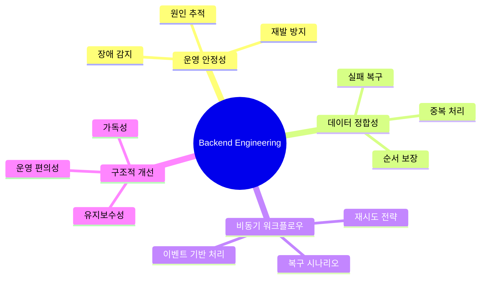

# bang9ming9

문제를 빠르게 우회하기보다 원인을 추적하고 구조적으로 해결하는 백엔드 엔지니어입니다.

복잡한 서비스 환경에서 기능 구현에 그치지 않고, 실제 운영에서 안정적으로 동작하는 구조를 만드는 데 집중해 왔습니다.  
데이터 정합성, 비동기 처리, 재시도/복구, 이벤트 기반 워크플로우를 꾸준히 다뤄 왔습니다.

## What I focus on

- 운영 환경에서 안정적으로 동작하는 백엔드 설계
- 데이터 정합성과 실패 복구를 고려한 처리 흐름 구성
- 비동기/이벤트 기반 워크플로우의 신뢰성 개선
- 임시 대응보다 재발 방지를 위한 구조적 개선
- 빠르게 커진 시스템을 유지보수 가능한 형태로 정리

## Tech

- **Primary**: Go, Solidity
- **Backend Experience**: TypeScript, MySQL, Redis, Amazon MQ

## Engineering Mindmap

## Highlighted Projects

- 운영 중 백엔드 서비스 안정화 및 구조 개선
- 데이터 정합성 이슈 분석 및 처리 흐름 개선
- 비동기/이벤트 기반 처리의 재시도·복구 전략 정비

## Contact

- Email: `smk940721@gmail.com`
