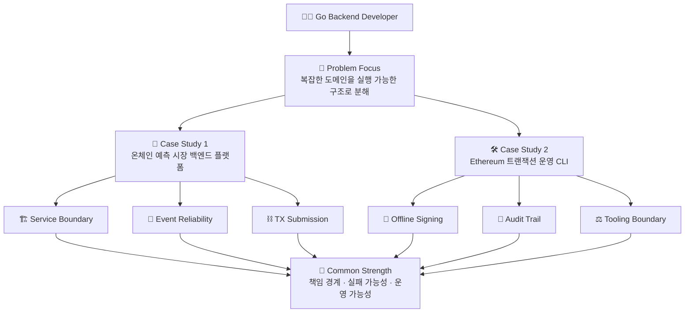
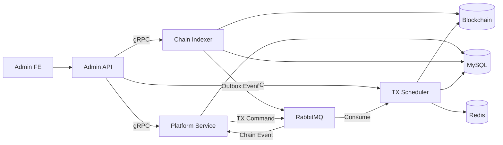
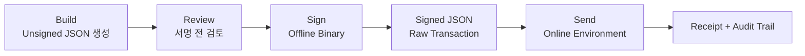
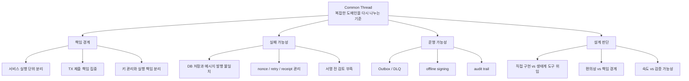
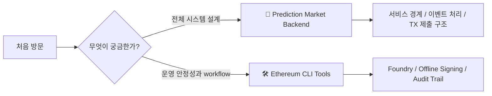

# Go Backend Case Studies

**복잡한 온체인/오프체인 문제를**  
**실행 가능한 백엔드 구조와 운영 workflow로 바꾼 사례들**

> [!NOTE]
> 이 문서는 기술 스택을 많이 나열하기 위한 README가 아니라,  
> 실제 업무에서 마주한 문제를 **어떤 기준으로 나누고, 어떤 구조로 해결했는지**를 보여주기 위한 포트폴리오 입구 문서입니다.

---

## Overview

---

## About Me

저는 Go 기반 백엔드 개발자로서, API 구현에 그치지 않고 **복잡한 도메인을 실행 가능한 구조로 나누고 운영 중 발생할 수 있는 실패 가능성을 줄이는 설계**에 관심이 있습니다.

특히 온체인/오프체인 시스템처럼 외부 상태와 내부 도메인 상태가 함께 움직이는 환경에서 다음 문제를 주로 다뤘습니다.

| 관점 | 다뤄온 질문 |
|---|---|
| **Service Boundary** | 어떤 책임을 어느 실행 단위에 둘 것인가? |
| **Communication** | REST, gRPC, AMQP의 역할을 어떻게 나눌 것인가? |
| **Reliability** | DB 저장과 메시지 발행 사이의 불일치를 어떻게 줄일 것인가? |
| **On-chain Integration** | 체인 이벤트 수집과 온체인 TX 제출을 어떻게 백엔드 흐름에 연결할 것인가? |
| **Operation Workflow** | 개인키 사용, 서명, 전송, 감사 로그를 어떻게 검토 가능한 절차로 만들 것인가? |
| **Documentation** | 빠른 개발 중에도 설계 의도와 검증 기준을 어떻게 남길 것인가? |

---

## Case Studies

| Case Study | Scope | Core Keywords | What it shows |
|---|---|---|---|
| [📘 온체인 예측 시장 백엔드 플랫폼 설계 및 개발](./projects/onchain-prediction-market-backend.md) | 실서비스 백엔드 시스템 | `Go` `gRPC` `AMQP` `Outbox` `tx-scheduler` `EDD` | 서비스 경계 설계, 이벤트 처리 신뢰성, 온체인 TX 제출 책임 분리 |
| [🛠️ Ethereum 트랜잭션 운영 리스크를 줄이기 위한 CLI 도구셋 개발](./projects/ethereum-transaction-cli-tools.md) | 운영 CLI 도구셋 | `Go` `Foundry` `Offline Signing` `Audit Trail` `Keystore` | 위험한 온체인 운영 작업을 단계와 산출물 중심 workflow로 재구성 |

---

## 1) 온체인 예측 시장 백엔드 플랫폼 설계 및 개발

> [!TIP]
> 전체 시스템 설계, 서비스 경계, 이벤트 처리, 온체인 TX 제출 구조를 보고 싶다면 이 문서부터 읽는 것을 추천합니다.

이 프로젝트는 실서비스로 운영되는 온체인 예측 시장에서 **관리자 요청, 도메인 처리, 체인 이벤트 수집, 온체인 TX 제출 흐름을 책임별 실행 단위로 분리한 사례**입니다.

핵심 설계는 다음과 같습니다.

| Decision | Why |
|---|---|
| **REST / gRPC 경계 분리** | 외부 운영 API와 내부 서비스 계약의 역할을 분리하기 위해 |
| **Outbox Pattern** | 체인 이벤트 저장과 메시지 발행 사이의 실패 가능성을 줄이기 위해 |
| **tx-scheduler 분리** | nonce, retry, gas, receipt 처리를 개별 서비스가 아니라 전담 컴포넌트에서 관리하기 위해 |
| **EDD 기반 문서화** | 구현 전에 요구사항, 경계, 실패 시나리오, 검증 기준을 정리하기 위해 |

➡️ **[자세히 보기](./projects/onchain-prediction-market-backend.md)**

---

## 2) Ethereum 트랜잭션 운영 리스크를 줄이기 위한 CLI 도구셋 개발

> [!TIP]
> 민감한 온체인 운영 작업을 어떻게 검토 가능한 workflow로 바꿨는지 보고 싶다면 이 문서를 추천합니다.

이 프로젝트는 컨트랙트 운영 과정에서 반복되던 Go 운영 스크립트 개발과 개인키 사용 환경 혼재를 줄이고, 트랜잭션 실행을 **build / sign / send** 단계로 분리한 운영 도구 설계 사례입니다.

핵심 설계는 다음과 같습니다.

| Decision | Why |
|---|---|
| **Foundry 도입** | build, artifact, ABI, deploy는 검증된 생태계 도구에 위임하기 위해 |
| **build / sign / send 분리** | 트랜잭션 실행을 검토 가능한 단계와 산출물 중심 workflow로 만들기 위해 |
| **offline signing** | 개인키 사용 환경과 네트워크 전송 환경을 분리하기 위해 |
| **keystore / transaction lifecycle 분리** | 키 관리와 트랜잭션 실행 책임의 경계를 명확히 하기 위해 |

➡️ **[자세히 보기](./projects/ethereum-transaction-cli-tools.md)**

---

## Common Thread

두 프로젝트는 범위가 다릅니다. 하나는 실서비스 백엔드 시스템 전체의 책임 경계를 다룬 사례이고, 다른 하나는 온체인 운영 작업의 실행 절차와 보안·감사 흐름을 다룬 사례입니다.

하지만 문제를 바라보는 방식은 같습니다.

이 포트폴리오에서 보여주고 싶은 핵심 역량은 다음과 같습니다.

| Area | What I focused on |
|---|---|
| **Backend System Design** | Go 기반 서비스의 책임 경계와 내부 실행 단위 설계 |
| **Reliability Engineering** | Outbox, retry, DLQ, nonce, receipt polling 등 실패 가능성 관리 |
| **On-chain / Off-chain Integration** | 체인 이벤트와 백엔드 상태 전이를 연결하는 구조 설계 |
| **Operation Workflow** | 서명, 전송, 감사 로그를 검토 가능한 운영 절차로 분리 |
| **Technical Judgment** | 직접 구현할 영역과 검증된 도구에 위임할 영역 구분 |
| **Documentation** | 구현 전에 설계 의도와 검증 기준을 정리하는 개발 방식 |

---

## Recommended Reading Path

1. **[온체인 예측 시장 백엔드 플랫폼 설계 및 개발](./projects/onchain-prediction-market-backend.md)**  
   전체 시스템 설계, 서비스 경계, 이벤트 처리, TX 제출 구조를 먼저 볼 수 있습니다.

2. **[Ethereum 트랜잭션 운영 리스크를 줄이기 위한 CLI 도구셋 개발](./projects/ethereum-transaction-cli-tools.md)**  
   운영 자동화, offline signing, Foundry 도입, 감사 가능한 workflow 설계를 더 구체적으로 볼 수 있습니다.

---

## Public Disclosure

> [!IMPORTANT]
> 이 문서는 실제 업무 경험을 기반으로 작성했지만, 공개 가능한 범위 안에서 내용을 일반화했습니다.

- 실제 서비스명과 내부 코드명은 공개하지 않았습니다.
- secret, 사설 인프라 정보, 운영 config, 감사 보고서 세부 내용은 제외했습니다.
- 외부 프로토콜 fork 기반 영역은 직접 설계·구현한 영역과 구분해 설명합니다.
- 보안 관련 내용은 적용 목적과 한계를 함께 설명합니다.
