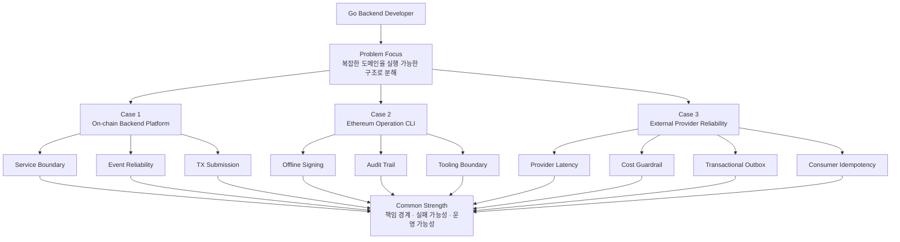
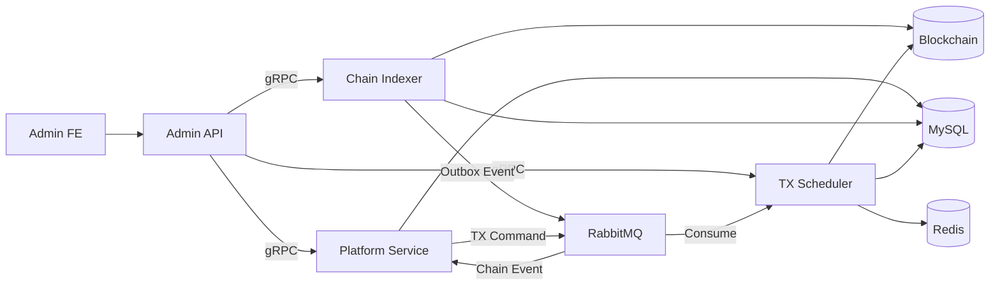
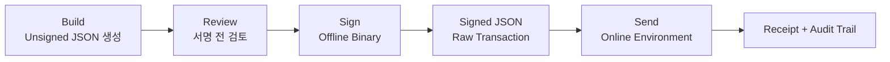
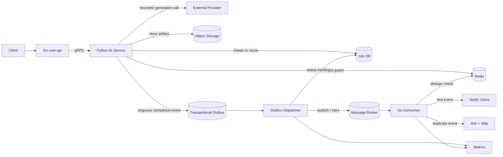
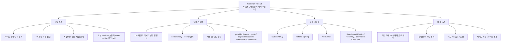
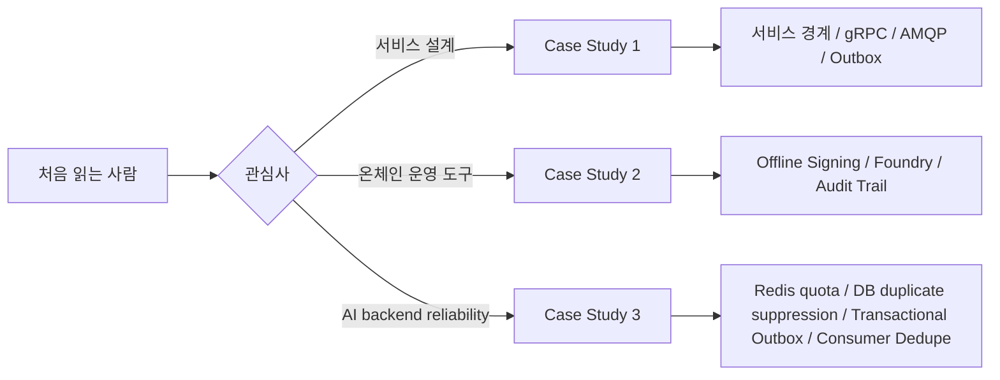

# Go Backend Reliability Case Studies

Go 기반 백엔드 경험을 중심으로, **외부 dependency를 포함한 시스템을 어떻게 안정적으로 운영 가능한 구조로 나눴는지**를 정리한 포트폴리오입니다.

> 기술 스택을 많이 나열하기보다, 실제 문제를 어떤 기준으로 나누고 어떤 구조로 해결했는지를 보여주기 위한 포트폴리오입니다.
>
> Go 기반 백엔드 경험을 중심에 두되, 온체인 시스템과 외부 비용성 provider처럼 **외부 상태·비용·장애를 동반하는 dependency**를 어떻게 운영 가능한 형태로 다뤘는지도 함께 보여줍니다.

---

## At a glance

| Case | Focus | Keywords |
|---|---|---|
| [온체인 예측 시장 백엔드 플랫폼](./projects/onchain-prediction-market-backend.md) | 서비스 경계, 이벤트 신뢰성, 온체인 TX 제출 책임 분리 | `Go` `gRPC` `AMQP` `Outbox` `tx-scheduler` |
| [Ethereum 트랜잭션 운영 CLI](./projects/ethereum-transaction-cli-tools.md) | 위험한 온체인 운영 작업을 검토 가능한 workflow로 재구성 | `Go` `Foundry` `Offline Signing` `Audit Trail` |
| [외부 비용성 Provider 연동 백엔드 안정화](./projects/external-ai-model-call-backend-stabilization.md) | 외부 provider 호출 비용, 중복 실행, outbox, consumer idempotency 제어 | `Python` `Go` `gRPC` `Redis` `Transactional Outbox` |

```mermaid
flowchart TD
    A[Go Backend Developer] --> B[Problem Focus<br/>복잡한 도메인을 실행 가능한 구조로 분해]

    B --> C[Case 1<br/>On-chain Backend Platform]
    B --> D[Case 2<br/>Ethereum Operation CLI]
    B --> E[Case 3<br/>External Provider Reliability]

    C --> C1[Service Boundary]
    C --> C2[Event Reliability]
    C --> C3[TX Submission]

    D --> D1[Offline Signing]
    D --> D2[Audit Trail]
    D --> D3[Tooling Boundary]

    E --> E1[Provider Latency]
    E --> E2[Cost Guardrail]
    E --> E3[Transactional Outbox]
    E --> E4[Consumer Idempotency]

    C1 --> F[Common Strength<br/>책임 경계 · 실패 가능성 · 운영 가능성]
    C2 --> F
    C3 --> F
    D1 --> F
    D2 --> F
    D3 --> F
    E1 --> F
    E2 --> F
    E3 --> F
    E4 --> F
```

---

## About Me

저는 Go 기반 백엔드 개발자로서, API 구현에 그치지 않고 **복잡한 도메인을 실행 가능한 구조로 나누고 운영 중 발생할 수 있는 실패 가능성을 줄이는 설계**에 관심이 있습니다.

특히 온체인/오프체인 시스템처럼 외부 상태와 내부 도메인 상태가 함께 움직이는 환경, 그리고 외부 AI provider처럼 비용과 장애가 함께 발생하는 dependency를 다루는 환경에서 다음 문제를 주로 다뤘습니다.

| 관점 | 다뤄온 질문 |
|---|---|
| Service Boundary | 어떤 책임을 어느 실행 단위에 둘 것인가? |
| Communication | REST, gRPC, AMQP의 역할을 어떻게 나눌 것인가? |
| Reliability | DB 저장, 외부 호출, 메시지 발행 사이의 불일치를 어떻게 줄일 것인가? |
| On-chain Integration | 체인 이벤트 수집과 온체인 TX 제출을 어떻게 백엔드 흐름에 연결할 것인가? |
| External Dependency | 외부 provider 지연, retry 비용, quota, 중복 요청, completion event 실패를 어떻게 제어할 것인가? |
| Operation Workflow | 개인키 사용, 서명, 전송, 감사 로그를 어떻게 검토 가능한 절차로 만들 것인가? |
| Documentation | 빠른 개발 중에도 설계 의도와 검증 기준을 어떻게 남길 것인가? |

---

## Case Studies

### 1. 온체인 예측 시장 백엔드 플랫폼 설계 및 개발

> 전체 시스템 설계, 서비스 경계, 이벤트 처리, 온체인 TX 제출 구조를 보고 싶다면 이 문서부터 읽는 것을 추천합니다.

[자세히 보기](./projects/onchain-prediction-market-backend.md)

```mermaid
flowchart LR
    FE[Admin FE] --> API[Admin API]
    API -->|gRPC| PS[Platform Service]
    API -->|gRPC| CI[Chain Indexer]
    API -->|gRPC| TX[TX Scheduler]

    CI -->|Outbox Event| MQ[RabbitMQ]
    PS -->|TX Command| MQ
    MQ -->|Consume| TX
    MQ -->|Chain Event| PS

    CI --> CHAIN[(Blockchain)]
    TX --> CHAIN

    PS --> DB[(MySQL)]
    CI --> DB
    TX --> DB
    TX --> REDIS[(Redis)]
```

이 프로젝트는 실서비스로 운영되는 온체인 예측 시장에서 관리자 요청, 도메인 처리, 체인 이벤트 수집, 온체인 TX 제출 흐름을 책임별 실행 단위로 분리한 사례입니다.

| Decision | Why |
|---|---|
| REST / gRPC 경계 분리 | 외부 운영 API와 내부 서비스 계약의 역할을 분리하기 위해 |
| Outbox Pattern | 체인 이벤트 저장과 메시지 발행 사이의 실패 가능성을 줄이기 위해 |
| tx-scheduler 분리 | nonce, retry, gas, receipt 처리를 전담 컴포넌트에서 관리하기 위해 |
| EDD 기반 문서화 | 구현 전에 요구사항, 경계, 실패 시나리오, 검증 기준을 정리하기 위해 |

---

### 2. Ethereum 트랜잭션 운영 리스크를 줄이기 위한 CLI 도구셋 개발

> 민감한 온체인 운영 작업을 어떻게 검토 가능한 workflow로 바꿨는지 보고 싶다면 이 문서를 추천합니다.

[자세히 보기](./projects/ethereum-transaction-cli-tools.md)

```mermaid
flowchart LR
    A[Build<br/>Unsigned JSON 생성] --> B[Review<br/>서명 전 검토]
    B --> C[Sign<br/>Offline Binary]
    C --> D[Signed JSON<br/>Raw Transaction]
    D --> E[Send<br/>Online Environment]
    E --> F[Receipt + Audit Trail]
```

이 프로젝트는 컨트랙트 운영 과정에서 반복되던 Go 운영 스크립트 개발과 개인키 사용 환경 혼재를 줄이고, 트랜잭션 실행을 build / sign / send 단계로 분리한 운영 도구 설계 사례입니다.

| Decision | Why |
|---|---|
| Foundry 도입 | build, artifact, ABI, deploy는 검증된 생태계 도구에 위임하기 위해 |
| build / sign / send 분리 | 트랜잭션 실행을 검토 가능한 단계와 산출물 중심 workflow로 만들기 위해 |
| offline signing | 개인키 사용 환경과 네트워크 전송 환경을 분리하기 위해 |
| keystore / transaction lifecycle 분리 | 키 관리와 트랜잭션 실행 책임의 경계를 명확히 하기 위해 |

---

### 3. 외부 비용성 Provider 연동 백엔드 안정화

> Python AI service와 Go user-api가 연동되는 구조에서 외부 provider 호출을 비용과 장애를 동반하는 운영 dependency로 다루고, quota / idempotency / transactional outbox / consumer dedupe를 어떻게 보강했는지 보고 싶다면 이 문서를 추천합니다.

[자세히 보기](./projects/external-ai-model-call-backend-stabilization.md)

```mermaid
flowchart LR
    Client[Client] --> GoAPI[Go user-api]
    GoAPI -->|gRPC| API[Python AI Service]

    API -->|create or reuse| DB[(Job DB)]
    API -->|quota / burst guard| Redis[(Redis)]
    API -->|bounded generation call| Provider[External Provider]
    API -->|store artifact| Storage[(Object Storage)]
    API -->|enqueue completion event| Outbox[(Transactional Outbox)]

    Outbox --> Dispatcher[Outbox Dispatcher]
    Dispatcher -->|publish / retry| Broker[(Message Broker)]
    Dispatcher -->|status tracking| DB

    Broker --> Consumer[Go Consumer]
    Consumer -->|dedupe check| Redis
    Consumer -->|first event| Notify[Notify Client]
    Consumer -->|duplicate event| Ack[Ack + Skip]

    Dispatcher --> Metrics[Metrics]
    Consumer --> Metrics
```

이 프로젝트는 기능 중심의 생성 백엔드를 실서비스 준비 수준으로 끌어올리며, 외부 provider 호출을 단순 연동이 아니라 **비용과 장애를 동반한 운영 dependency**로 다룬 사례입니다.

| Decision | Why |
|---|---|
| timeout / retry budget | worker 무한 점유와 비용성 retry를 동시에 제한하기 위해 |
| duplicate request reuse | 동일 요청 반복으로 인한 중복 생성 비용을 줄이기 위해 |
| Redis quota / burst limit | 신규 generation 진입 전 비용성 dependency 호출을 제한하기 위해 |
| DB-level duplicate suppression | 동시 요청 경쟁에서도 active generation 중복 생성을 애플리케이션 체크에만 의존하지 않기 위해 |
| stage-based retry boundary | generation / download / upload / publish 중 일부 실패가 불필요한 재생성으로 이어지지 않게 하기 위해 |
| transactional outbox | 완료 artifact 저장과 completion event 발행 사이의 불일치를 복구 가능한 상태로 남기기 위해 |
| consumer idempotency | at-least-once delivery에서 중복 completion event가 사용자 알림을 반복하지 않게 하기 위해 |
| readiness / metrics | provider 지연, quota 차단, billable call, outbox retry, duplicate skip을 운영 관점에서 관찰하기 위해 |

---

## Common Thread

세 프로젝트는 범위가 다릅니다.

- 하나는 실서비스 백엔드 시스템 전체의 책임 경계를 다룬 사례입니다.
- 하나는 온체인 운영 작업의 실행 절차와 보안·감사 흐름을 다룬 사례입니다.
- 하나는 외부 비용성 provider를 포함한 백엔드 운영 안정화를 다룬 사례입니다.

하지만 문제를 바라보는 방식은 같습니다.

```mermaid
flowchart TB
    A[Common Thread<br/>복잡한 도메인을 다시 나누는 기준]

    A --> B[책임 경계]
    A --> C[실패 가능성]
    A --> D[운영 가능성]
    A --> E[설계 판단]

    B --> B1[서비스 실행 단위 분리]
    B --> B2[TX 제출 책임 집중]
    B --> B3[키 관리와 실행 책임 분리]
    B --> B4[외부 provider 호출과 event publish 책임 분리]

    C --> C1[DB 저장과 메시지 발행 불일치]
    C --> C2[nonce / retry / receipt 관리]
    C --> C3[서명 전 검토 부족]
    C --> C4[provider timeout / quota / duplicate request / completion event failure]

    D --> D1[Outbox / DLQ]
    D --> D2[Offline Signing]
    D --> D3[Audit Trail]
    D --> D4[Readiness / Metrics / Recovery / Idempotent Consumer]

    E --> E1[직접 구현 vs 생태계 도구 위임]
    E --> E2[편의성 vs 책임 경계]
    E --> E3[속도 vs 검증 가능성]
    E --> E4[재시도 허용 vs 비용 통제]
```

이 포트폴리오에서 보여주고 싶은 핵심 역량은 다음과 같습니다.

| Area | What I focused on |
|---|---|
| Backend System Design | Go 기반 서비스의 책임 경계와 내부 실행 단위 설계 |
| Reliability Engineering | outbox, DLQ, retry, idempotency, recovery를 통한 실패 가능성 제어 |
| External Dependency Control | 외부 provider 지연, quota, duplicate request, completion event failure, consumer idempotency 제어 |
| On-chain Operation Safety | 개인키, 서명, 전송, receipt, audit trail을 단계화 |
| Documentation Discipline | 구현 결과보다 설계 판단과 검증 기준을 남기는 문서화 |

---

## Recommended Reading Path

```mermaid
flowchart LR
    A[처음 읽는 사람] --> B{관심사}
    B -->|서비스 설계| C[Case Study 1]
    B -->|온체인 운영 도구| D[Case Study 2]
    B -->|AI backend reliability| E[Case Study 3]

    C --> C1[서비스 경계 / gRPC / AMQP / Outbox]
    D --> D1[Offline Signing / Foundry / Audit Trail]
    E --> E1[Redis quota / DB duplicate suppression / Transactional Outbox / Consumer Dedupe]
```

- 전체 백엔드 설계와 서비스 경계를 보고 싶다면 [온체인 예측 시장 백엔드 플랫폼 설계 및 개발](./projects/onchain-prediction-market-backend.md)을 먼저 읽는 것을 추천합니다.
- 운영 리스크를 줄이기 위한 도구 설계와 오프라인 서명 workflow가 궁금하다면 [Ethereum 트랜잭션 운영 리스크를 줄이기 위한 CLI 도구셋 개발](./projects/ethereum-transaction-cli-tools.md)을 추천합니다.
- 외부 provider 호출, timeout/retry budget, Redis quota, DB-level duplicate suppression, transactional outbox, consumer idempotency가 궁금하다면 [외부 비용성 Provider 연동 백엔드 안정화](./projects/external-ai-model-call-backend-stabilization.md)를 추천합니다.
