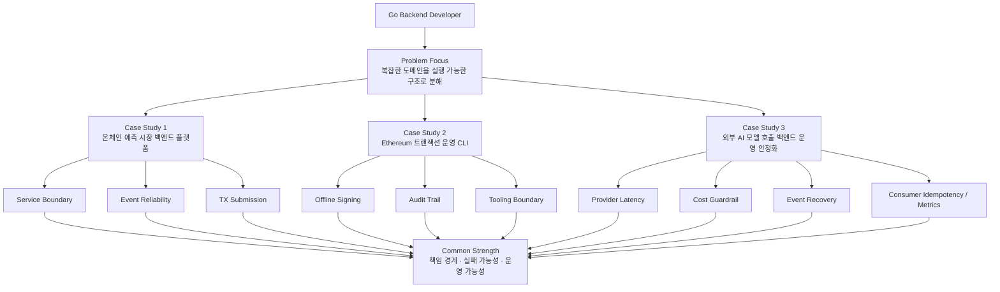
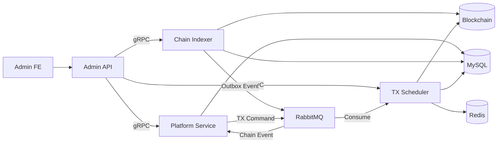
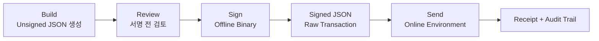
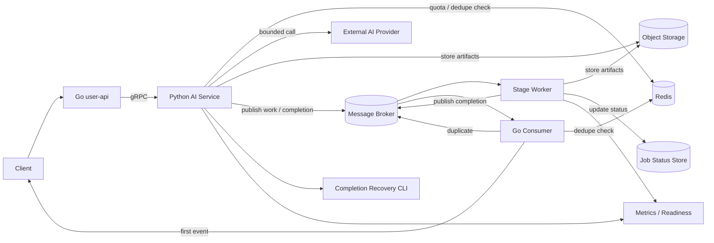
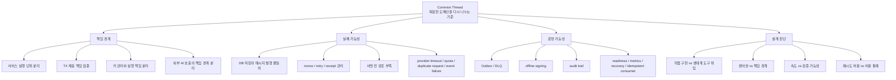
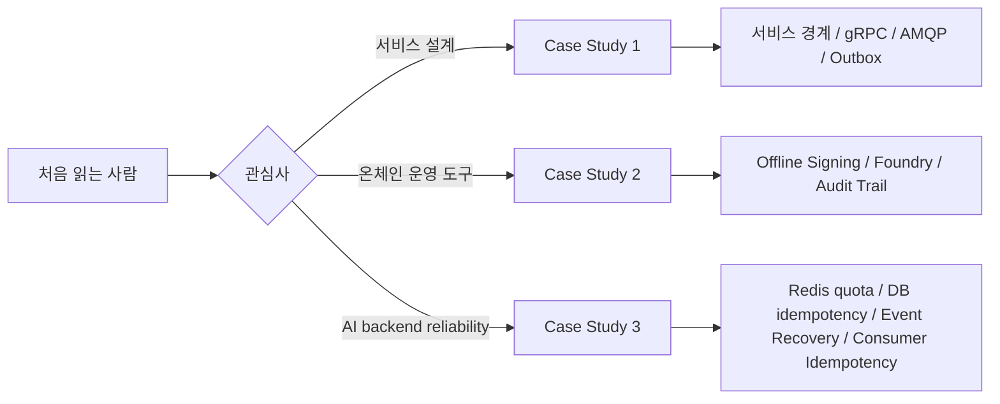

# Go Backend Reliability Case Studies

Go 기반 백엔드 경험을 중심으로, 외부 dependency와 운영 안정성 문제까지 다룬 사례들을 정리한 포트폴리오입니다.

> 이 README는 기술 스택을 많이 나열하기 위한 문서가 아니라, 실제 업무에서 마주한 문제를 어떤 기준으로 나누고 어떤 구조로 해결했는지를 보여주기 위한 포트폴리오 입구 문서입니다.
>
> Go 기반 백엔드 경험을 중심에 두되, 외부 AI provider처럼 비용과 장애를 동반하는 dependency를 어떻게 운영 가능한 형태로 다뤘는지도 함께 보여줍니다.

---

## Overview

```mermaid
flowchart TD
    A[Go Backend Developer] --> B[Problem Focus<br/>복잡한 도메인을 실행 가능한 구조로 분해]

    B --> C[Case Study 1<br/>온체인 예측 시장 백엔드 플랫폼]
    B --> D[Case Study 2<br/>Ethereum 트랜잭션 운영 CLI]
    B --> E[Case Study 3<br/>외부 AI 모델 호출 백엔드 운영 안정화]

    C --> C1[Service Boundary]
    C --> C2[Event Reliability]
    C --> C3[TX Submission]

    D --> D1[Offline Signing]
    D --> D2[Audit Trail]
    D --> D3[Tooling Boundary]

    E --> E1[Provider Latency]
    E --> E2[Cost Guardrail]
    E --> E3[Event Recovery]
    E --> E4[Consumer Idempotency / Metrics]

    C1 --> F[Common Strength<br/>책임 경계 · 실패 가능성 · 운영 가능성]
    C2 --> F
    C3 --> F
    D1 --> F
    D2 --> F
    D3 --> F
    E1 --> F
    E2 --> F
    E3 --> F
    E4 --> F
```

---

## About Me

저는 Go 기반 백엔드 개발자로서, API 구현에 그치지 않고 복잡한 도메인을 실행 가능한 구조로 나누고 운영 중 발생할 수 있는 실패 가능성을 줄이는 설계에 관심이 있습니다.

특히 온체인/오프체인 시스템처럼 외부 상태와 내부 도메인 상태가 함께 움직이는 환경에서 다음 문제를 주로 다뤘습니다.

| 관점 | 다뤄온 질문 |
|---|---|
| Service Boundary | 어떤 책임을 어느 실행 단위에 둘 것인가? |
| Communication | REST, gRPC, AMQP의 역할을 어떻게 나눌 것인가? |
| Reliability | DB 저장과 메시지 발행 사이의 불일치를 어떻게 줄일 것인가? |
| On-chain Integration | 체인 이벤트 수집과 온체인 TX 제출을 어떻게 백엔드 흐름에 연결할 것인가? |
| External Dependency | 외부 AI provider 지연, retry 비용, quota, 중복 요청, completion event 실패, consumer idempotency를 어떻게 제어할 것인가? |
| Operation Workflow | 개인키 사용, 서명, 전송, 감사 로그를 어떻게 검토 가능한 절차로 만들 것인가? |
| Documentation | 빠른 개발 중에도 설계 의도와 검증 기준을 어떻게 남길 것인가? |

---

## Case Studies

| Case Study | Scope | Core Keywords | What it shows |
|---|---|---|---|
| [온체인 예측 시장 백엔드 플랫폼 설계 및 개발](./projects/onchain-prediction-market-backend.md) | 실서비스 백엔드 시스템 | `Go` `gRPC` `AMQP` `Outbox` `tx-scheduler` `EDD` | 서비스 경계 설계, 이벤트 처리 신뢰성, 온체인 TX 제출 책임 분리 |
| [Ethereum 트랜잭션 운영 리스크를 줄이기 위한 CLI 도구셋 개발](./projects/ethereum-transaction-cli-tools.md) | 운영 CLI 도구셋 | `Go` `Foundry` `Offline Signing` `Audit Trail` `Keystore` | 위험한 온체인 운영 작업을 단계와 산출물 중심 workflow로 재구성 |
| [외부 AI 모델 호출 백엔드 운영 안정화](./projects/external-ai-model-call-backend-stabilization.md) | 비공개 실서비스 준비 백엔드 | `Python` `Go` `gRPC` `Redis` `Message Broker` `Idempotency` `Event Recovery` `Metrics` | 외부 AI provider 호출의 timeout/retry 비용, duplicate generation, quota, completion event recovery, consumer idempotency를 단계적으로 제어 |

---

## 1) 온체인 예측 시장 백엔드 플랫폼 설계 및 개발

> 전체 시스템 설계, 서비스 경계, 이벤트 처리, 온체인 TX 제출 구조를 보고 싶다면 이 문서부터 읽는 것을 추천합니다.

```mermaid
flowchart LR
    FE[Admin FE] --> API[Admin API]

    API -->|gRPC| PS[Platform Service]
    API -->|gRPC| CI[Chain Indexer]
    API -->|gRPC| TX[TX Scheduler]

    CI -->|Outbox Event| MQ[RabbitMQ]
    PS -->|TX Command| MQ
    MQ -->|Consume| TX
    MQ -->|Chain Event| PS

    CI --> CHAIN[(Blockchain)]
    TX --> CHAIN
    PS --> DB[(MySQL)]
    CI --> DB
    TX --> DB
    TX --> REDIS[(Redis)]
```

이 프로젝트는 실서비스로 운영되는 온체인 예측 시장에서 관리자 요청, 도메인 처리, 체인 이벤트 수집, 온체인 TX 제출 흐름을 책임별 실행 단위로 분리한 사례입니다.

핵심 설계는 다음과 같습니다.

| Decision | Why |
|---|---|
| REST / gRPC 경계 분리 | 외부 운영 API와 내부 서비스 계약의 역할을 분리하기 위해 |
| Outbox Pattern | 체인 이벤트 저장과 메시지 발행 사이의 실패 가능성을 줄이기 위해 |
| tx-scheduler 분리 | nonce, retry, gas, receipt 처리를 개별 서비스가 아니라 전담 컴포넌트에서 관리하기 위해 |
| EDD 기반 문서화 | 구현 전에 요구사항, 경계, 실패 시나리오, 검증 기준을 정리하기 위해 |

[자세히 보기](./projects/onchain-prediction-market-backend.md)

---

## 2) Ethereum 트랜잭션 운영 리스크를 줄이기 위한 CLI 도구셋 개발

> 민감한 온체인 운영 작업을 어떻게 검토 가능한 workflow로 바꿨는지 보고 싶다면 이 문서를 추천합니다.

```mermaid
flowchart LR
    A[Build<br/>Unsigned JSON 생성] --> B[Review<br/>서명 전 검토]
    B --> C[Sign<br/>Offline Binary]
    C --> D[Signed JSON<br/>Raw Transaction]
    D --> E[Send<br/>Online Environment]
    E --> F[Receipt + Audit Trail]
```

이 프로젝트는 컨트랙트 운영 과정에서 반복되던 Go 운영 스크립트 개발과 개인키 사용 환경 혼재를 줄이고, 트랜잭션 실행을 build / sign / send 단계로 분리한 운영 도구 설계 사례입니다.

핵심 설계는 다음과 같습니다.

| Decision | Why |
|---|---|
| Foundry 도입 | build, artifact, ABI, deploy는 검증된 생태계 도구에 위임하기 위해 |
| build / sign / send 분리 | 트랜잭션 실행을 검토 가능한 단계와 산출물 중심 workflow로 만들기 위해 |
| offline signing | 개인키 사용 환경과 네트워크 전송 환경을 분리하기 위해 |
| keystore / transaction lifecycle 분리 | 키 관리와 트랜잭션 실행 책임의 경계를 명확히 하기 위해 |

[자세히 보기](./projects/ethereum-transaction-cli-tools.md)

---

## 3) 외부 AI 모델 호출 백엔드 운영 안정화

> Python AI service와 Go user-api가 연동되는 구조에서 AI provider 호출을 비용과 장애를 동반하는 운영 dependency로 다루고, quota / idempotency / event recovery를 어떻게 보강했는지 보고 싶다면 이 문서를 추천합니다.

```mermaid
flowchart LR
    Client[Client] --> GoAPI[Go user-api]
    GoAPI -->|gRPC| API[Python AI Service]
    API -->|quota / dedupe check| Redis[(Redis)]
    API -->|bounded call| Provider[External AI Provider]
    API -->|store artifacts| Storage[(Object Storage)]
    API -->|publish work / completion| Broker[(Message Broker)]

    Broker --> Worker[Stage Worker]
    Worker -->|store artifacts| Storage
    Worker -->|update status| Status[(Job Status Store)]
    Worker -->|publish completion| Broker

    Broker --> GoConsumer[Go Consumer]
    GoConsumer -->|dedupe check| Redis
    GoConsumer -->|first event| Client
    GoConsumer -->|duplicate| Broker

    API --> Recovery[Completion Recovery CLI]
    API --> Obs[Metrics / Readiness]
    Worker --> Obs
```

이 프로젝트는 기능 중심의 AI 이미지 생성 백엔드를 실서비스 준비 수준으로 끌어올리며, Python AI service와 Go user-api 연계 구간에서 외부 AI provider 호출을 단순 연동이 아니라 비용과 장애를 동반한 운영 dependency로 다룬 사례입니다.

핵심은 전체 흐름을 모두 비동기로 갈아엎는 것이 아니라, 기존 동기 preview 흐름은 timeout/retry budget으로 worker 점유와 비용을 제한하고, 후속 고비용 생성 흐름은 message broker 기반 stage 분리로 재구성했다는 점입니다.

이후 비용과 중복 실행을 더 직접적으로 막기 위해 Redis quota/burst limit으로 신규 generation 요청을 provider 호출 전에 차단하고, provider billable call metric으로 비용성 호출을 관찰하도록 보강했습니다. request hash 기반 DB-level active uniqueness로 동시 duplicate generation을 줄였고, completion event publish tracking과 manual recovery CLI로 완료 이벤트 발행 실패를 복구 가능한 상태로 남겼습니다.

Go user-api 쪽에서는 AI service의 `RESOURCE_EXHAUSTED` 계열 응답을 HTTP 429로 매핑하고, Redis dedupe를 통해 중복 completion event를 ack + skip 처리하도록 정리했습니다.

핵심 설계는 다음과 같습니다.

| Decision | Why |
|---|---|
| safe error mapping | 내부 exception과 provider raw error가 사용자 응답으로 직접 노출되지 않게 하기 위해 |
| production config fail-fast | 빈 secret, placeholder, dev fallback으로 production이 기동되는 위험을 막기 위해 |
| timeout / retry budget | worker 무한 점유와 비용 폭증을 동시에 제한하기 위해 |
| duplicate request reuse | 동일 요청 반복으로 인한 중복 생성 비용을 줄이기 위해 |
| Redis quota / burst limit | provider 호출 전에 과도한 신규 generation을 차단해 비용성 dependency 진입을 제한하기 위해 |
| provider billable metric | 단순 요청 수가 아니라 실제 비용으로 이어질 수 있는 호출을 관찰하기 위해 |
| DB-level active idempotency | 동시 요청 경쟁에서도 active generation 중복 생성을 애플리케이션 체크에만 의존하지 않기 위해 |
| DLQ 보장 | 메시지 처리 실패를 유실이 아니라 추적 가능한 상태로 남기기 위해 |
| stage-based retry | generation / download / upload / publish 중 일부 실패가 불필요한 재생성으로 이어지지 않게 하기 위해 |
| completion event tracking / manual recovery | 완료 상태 저장 이후 event publish 실패를 운영자가 식별하고 복구할 수 있게 하기 위해 |
| user-api consumer idempotency | at-least-once delivery에서 중복 completion event가 사용자 알림을 반복하지 않게 하기 위해 |
| readiness / liveness 분리 | 살아 있음과 서비스 가능 상태를 구분하기 위해 |
| metrics 보강 | provider 지연, 실패 지점, 재시도 패턴을 운영 관점에서 관찰하기 위해 |

[자세히 보기](./projects/external-ai-model-call-backend-stabilization.md)

---

## Common Thread

세 프로젝트는 범위가 다릅니다.

하나는 실서비스 백엔드 시스템 전체의 책임 경계를 다룬 사례이고, 다른 하나는 온체인 운영 작업의 실행 절차와 보안·감사 흐름을 다룬 사례이며, 세 번째는 외부 AI provider를 포함한 동기 preview와 후속 비동기 stage의 운영 안정화를 다룬 사례입니다.

하지만 문제를 바라보는 방식은 같습니다.

```mermaid
flowchart TB
    A[Common Thread<br/>복잡한 도메인을 다시 나누는 기준] --> B[책임 경계]
    A --> C[실패 가능성]
    A --> D[운영 가능성]
    A --> E[설계 판단]

    B --> B1[서비스 실행 단위 분리]
    B --> B2[TX 제출 책임 집중]
    B --> B3[키 관리와 실행 책임 분리]
    B --> B4[외부 AI 호출의 책임 경계 분리]

    C --> C1[DB 저장과 메시지 발행 불일치]
    C --> C2[nonce / retry / receipt 관리]
    C --> C3[서명 전 검토 부족]
    C --> C4[provider timeout / quota / duplicate request / event failure]

    D --> D1[Outbox / DLQ]
    D --> D2[offline signing]
    D --> D3[audit trail]
    D --> D4[readiness / metrics / recovery / idempotent consumer]

    E --> E1[직접 구현 vs 생태계 도구 위임]
    E --> E2[편의성 vs 책임 경계]
    E --> E3[속도 vs 검증 가능성]
    E --> E4[재시도 허용 vs 비용 통제]
```

이 포트폴리오에서 보여주고 싶은 핵심 역량은 다음과 같습니다.

| Area | What I focused on |
|---|---|
| Backend System Design | Go 기반 서비스의 책임 경계와 내부 실행 단위 설계 |
| Reliability Engineering | outbox, DLQ, retry, idempotency, recovery를 통한 실패 가능성 제어 |
| External Dependency Control | 외부 AI provider 지연, quota, duplicate request, completion event failure, consumer idempotency 제어 |
| On-chain Operation Safety | 개인키, 서명, 전송, receipt, audit trail을 단계화 |
| Documentation Discipline | 구현 결과보다 설계 판단과 검증 기준을 남기는 문서화 |

---

## Recommended Reading Path

```mermaid
flowchart LR
    A[처음 읽는 사람] --> B{관심사}
    B -->|서비스 설계| C[Case Study 1]
    B -->|온체인 운영 도구| D[Case Study 2]
    B -->|AI backend reliability| E[Case Study 3]

    C --> C1[서비스 경계 / gRPC / AMQP / Outbox]
    D --> D1[Offline Signing / Foundry / Audit Trail]
    E --> E1[Redis quota / DB idempotency / Event Recovery / Consumer Idempotency]
```

- 전체 백엔드 설계와 서비스 경계를 보고 싶다면 [온체인 예측 시장 백엔드 플랫폼 설계 및 개발](./projects/onchain-prediction-market-backend.md)을 먼저 읽는 것을 추천합니다.
- 운영 리스크를 줄이기 위한 도구 설계와 오프라인 서명 workflow가 궁금하다면 [Ethereum 트랜잭션 운영 리스크를 줄이기 위한 CLI 도구셋 개발](./projects/ethereum-transaction-cli-tools.md)을 추천합니다.
- 외부 AI provider 호출, timeout/retry budget, Redis quota, DB-level idempotency, completion event recovery, consumer idempotency가 궁금하다면 [외부 AI 모델 호출 백엔드 운영 안정화](./projects/external-ai-model-call-backend-stabilization.md)를 추천합니다.
