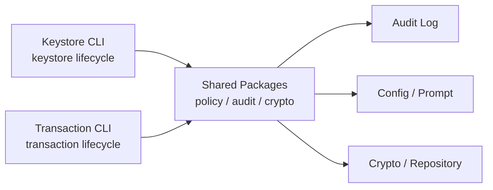
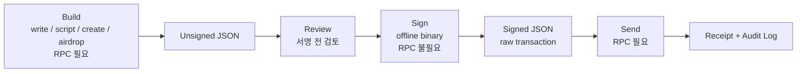

[← Back to Go Backend Case Studies](../README.md)

# Ethereum 트랜잭션 운영 리스크를 줄이기 위한 CLI 도구셋 개발

> 온체인 운영 과정에서 반복적으로 발생하던 컨트랙트별 운영 스크립트 개발, 개인키 사용 환경 혼재, 서명 전 검토 부족, 감사 로그 누락 가능성을 줄이기 위해 Go 기반 운영 CLI 도구셋을 설계하고 개발했습니다.

---

## 1. Summary

| 항목 | 내용 |
|---|---|
| 유형 | 실무 운영 도구 / 온체인 트랜잭션 운영 자동화 |
| 상태 | 내부 운영 도구 개선 및 운영 workflow 정비 |
| 역할 | 기존 운영 방식 분석, Foundry 도입 제안, CLI 구조 설계 및 구현 |
| 주요 기술 | Go, Ethereum, go-ethereum, Foundry, MySQL, TOML, audit logging |
| 핵심 주제 | 운영 workflow 분리, offline signing, keystore lifecycle, audit trail |
| 구성 | 트랜잭션 운영 CLI + keystore 관리 CLI |

이 프로젝트는 단순히 Ethereum CLI를 만든 경험이 아니라, **민감한 온체인 운영 작업을 검토 가능한 절차로 분리하고, 개인키 사용 환경과 네트워크 전송 환경을 나누어 운영 리스크를 줄인 사례**입니다.

핵심은 Go에서 모든 컨트랙트 운영 기능을 직접 구현하는 대신, Foundry가 잘 해결하는 build, artifact, ABI encoding, deploy 영역은 생태계 도구에 위임하고, Go CLI는 운영자가 실제로 수행하는 workflow, offline signing, audit trail, keystore 관리에 집중하도록 책임을 재정의한 것입니다.

---

## 2. Context / Problem

기존 방식에서는 컨트랙트가 새로 개발될 때마다 해당 컨트랙트를 호출하고, 트랜잭션을 만들고, 배포하기 위한 Go 코드가 함께 추가되어야 했습니다. ABI encoding, constructor argument 처리, bytecode 배포, script 실행 흐름도 운영 도구 내부에서 직접 관리했습니다.

이 구조는 컨트랙트가 늘어나거나 변경될수록 다음 문제를 만들었습니다.

- 컨트랙트 변경이 Go 운영 도구 변경으로 계속 전파됨
- 컨트랙트별 call/send/deploy 스크립트가 누적됨
- Solidity / OpenZeppelin version 선택이 운영 도구 제약을 받음
- Go CLI가 운영 workflow뿐 아니라 Solidity build tool 역할까지 떠안음
- 트랜잭션 생성·서명·전송이 섞여 서명 전 검토 지점이 부족함
- 개인키가 네트워크 접근 환경에서 사용될 가능성이 있음
- 실패 발생 시 build 문제인지, sign 문제인지, send 문제인지 구분하기 어려움

따라서 목표는 기능을 더 추가하는 것이 아니라, **컨트랙트 운영과 트랜잭션 실행을 책임과 절차 단위로 재구성하는 것**이었습니다.

---

## 3. My Role

제가 담당한 핵심 역할은 기존 Go 중심 컨트랙트 운영 방식의 유지보수 비용과 운영 리스크를 분석하고, Foundry 도입을 제안해 운영 도구의 책임을 재정의한 것입니다.

구체적으로는 다음 작업을 수행했습니다.

- Foundry(`forge`, `cast`) 학습 및 운영 CLI 도입 제안
- 컨트랙트별 Go 운영 스크립트가 누적되던 구조 개선
- 트랜잭션 lifecycle을 build / sign / send 단계로 분리
- RPC 없이 서명만 수행하는 offline signing 구조 설계 및 구현
- keystore 관리 CLI와 트랜잭션 운영 CLI의 책임 분리
- audit log 기록 및 중복 저장 방지 흐름 구현
- 공통 config, prompt, crypto, audit 정책을 재사용 가능한 패키지로 정리

---

## 4. Architecture / Workflow

이 도구셋은 역할이 다른 두 CLI로 구성했습니다.

| 도구 | 담당 영역 | 주요 기능 |
|---|---|---|
| 트랜잭션 운영 CLI | transaction lifecycle | write, script, create, airdrop, sign, send, verify, bind |
| keystore 관리 CLI | keystore lifecycle | gen, check, update, import, unlock, upload |

두 CLI는 역할은 분리하지만, audit, config, prompt, crypto, repository 정책은 공통 패키지로 재사용하도록 구성했습니다.

트랜잭션 운영 흐름은 다음과 같이 build / sign / send로 분리했습니다.

이 구조에서 중요한 점은 CLI 명령을 나눈 것이 아니라, **검토 가능한 운영 절차를 만든 것**입니다. 운영자는 build 단계에서 생성된 unsigned JSON을 검토한 뒤, 네트워크 연결이 없는 환경에서 sign을 수행하고, signed JSON만 온라인 환경으로 옮겨 send할 수 있습니다.

---

## 5. Key Decisions

### 5.1 Foundry 도입으로 반복 개발 비용 줄이기

기존에는 컨트랙트가 추가되거나 변경될 때마다 운영 도구에도 Go 코드가 함께 추가되어야 했습니다. 컨트랙트 call, send transaction, deploy 흐름을 Go에서 직접 작성했고, ABI encoding과 artifact 처리도 운영 도구가 직접 책임지는 구조였습니다.

저는 이 구조를 개선하기 위해 Foundry를 학습하고, `forge`와 `cast`를 운영 CLI에 도입하는 방향을 제안했습니다.

핵심 판단은 다음과 같았습니다.

> 컨트랙트 build, script 실행, ABI 기반 calldata 생성, deploy처럼 Foundry가 이미 잘 해결하고 있는 문제를 Go에서 계속 직접 구현하지 말자. Go CLI는 컨트랙트 개발 도구가 아니라 운영 workflow를 안전하게 실행하는 도구에 집중하자.

운영 CLI는 Foundry를 다음 영역에 활용했습니다.

- `forge` 기반 script 실행
- Foundry artifact 기반 contract create transaction 생성
- `cast` 기반 ABI encoding / contract call 보조
- 온체인 bytecode와 local artifact 비교
- Foundry project 구조 기반 ABI / artifact 탐색
- abigen 기반 Go binding 생성 흐름과 artifact 연계

결과적으로 Go CLI의 책임은 컨트랙트 build tool에서 운영 workflow 관리 도구로 재정의되었습니다. 컨트랙트별로 call/send/deploy 흐름을 Go 코드로 반복 추가하던 구조에서 벗어나, 컨트랙트 변경은 Foundry project와 artifact를 기준으로 처리하고 Go CLI는 운영 절차를 실행하는 역할에 집중할 수 있게 되었습니다.

이 결정의 핵심은 새로운 도구를 사용한 것이 아니라, **직접 구현할 영역과 검증된 생태계 도구에 위임할 영역을 구분해 시스템의 책임을 줄인 것**입니다.

---

### 5.2 build / sign / send 분리와 offline signing

Ethereum 트랜잭션은 생성, 서명, 전송이라는 서로 다른 성격의 단계를 가집니다. 이 단계를 하나의 명령으로 처리하면 서명 전 검토가 어렵고, 개인키가 네트워크 접근 환경에서 사용될 수 있으며, 실패 원인을 단계별로 구분하기 어렵습니다.

그래서 트랜잭션 lifecycle을 다음 세 단계로 분리했습니다.

| 단계 | 역할 | 개인키 필요 | 네트워크 필요 |
|---|---|---:|---:|
| Build | 서명 전 트랜잭션 JSON 생성 | 아니오 | 예 |
| Sign | 트랜잭션 JSON 오프라인 서명 | 예 | 아니오 |
| Send | 서명된 raw transaction 전송 | 아니오 | 예 |

특히 sign 단계는 별도 offline binary에서 실행할 수 있도록 구성했습니다. 이 바이너리는 sign 명령만 노출하고, RPC client를 초기화하지 않습니다.

이 설계를 통해 트랜잭션 실행은 단일 명령이 아니라, **unsigned JSON 검토 → offline signing → signed transaction 전송**이라는 검토 가능한 운영 절차가 되었습니다.

얻은 효과는 다음과 같습니다.

- 개인키 사용 환경과 네트워크 전송 환경 분리
- 서명 전 검토 지점 확보
- build / sign / send 단계별 실패 원인 분리
- signed raw transaction과 receipt를 audit trail로 보존
- 민감한 운영 작업을 사람이 검토 가능한 절차로 전환

---

### 5.3 keystore 관리와 transaction 실행 책임 분리

Ethereum 운영 도구에는 크게 두 가지 lifecycle이 있습니다.

첫 번째는 keystore lifecycle입니다.

- keystore 생성
- 비밀번호 검증
- 비밀번호 변경
- private key import
- share 기반 unlock 요청

두 번째는 transaction lifecycle입니다.

- 트랜잭션 생성
- 트랜잭션 서명
- 트랜잭션 전송
- receipt 확인
- airdrop batch 생성
- contract verify / bind

이 둘은 실패 양상, 권한, 운영자가 다를 수 있습니다. 하나의 CLI에 모두 넣으면 편의성은 높아질 수 있지만, 키 관리와 트랜잭션 실행의 책임 경계가 흐려질 수 있다고 판단했습니다.

그래서 keystore 관리 CLI와 transaction 운영 CLI를 분리했습니다. 대신 완전히 독립시키지는 않고, audit log, config, prompt, crypto 정책은 공통 패키지로 재사용하도록 구성했습니다.

이 구조는 단일 도구보다 사용자가 이해해야 할 개념은 늘어나지만, 운영 관점에서는 다음 장점을 제공합니다.

- 키 관리와 트랜잭션 실행의 책임 경계가 명확해짐
- CLI는 역할별로 분리되지만 공통 정책은 재사용 가능
- audit / config / prompt / crypto 규칙을 두 도구에서 일관되게 유지
- 운영 권한을 도구 단위로 구분하기 쉬워짐

---

## 6. Security / Audit Considerations

이 프로젝트의 보안·감사 관련 기능은 “완벽한 보안”을 주장하기 위한 것이 아니라, 민감한 운영 작업에서 단일 실패 지점을 줄이고 사후 추적 가능성을 높이기 위한 설계입니다.

| 항목 | 목적 | 한계 |
|---|---|---|
| offline signing | 개인키 사용 환경과 네트워크 전송 환경 분리 | 바이너리와 산출물 이동 절차 관리 필요 |
| audit trail | 실행 흐름, signed raw transaction, receipt 추적 | 로그 마스킹과 보관 정책은 별도로 관리 필요 |
| audit hash dedup | 동일 audit log 중복 저장 방지 | 변조 방지 hash chain은 아님 |
| share 기반 key access | private key 접근 권한이 단일 파일/단일 사용자에게 집중되는 위험 완화 | share/비밀번호 관리 부담 증가 |

특히 audit hash는 변조 방지가 아니라 중복 업로드 방지를 위한 dedup 목적입니다. 더 강한 무결성 검증이 필요하다면 별도의 hash chain이나 append-only storage가 필요합니다.

---

## 7. Technical Trade-offs

| 선택 | 대안 | 선택한 이유 | 비용 |
|---|---|---|---|
| Foundry 도입 | Solidity compile/deploy를 Go에서 직접 구현 | 검증된 생태계 도구를 활용해 반복 개발과 유지보수 부담 감소 | Foundry 사용법과 project 구조를 이해해야 함 |
| build/sign/send 단계 분리 | 단일 명령으로 즉시 전송 | 서명 전 검토와 오프라인 서명 가능 | 운영 절차와 산출물 관리 증가 |
| offline binary 분리 | full binary 하나만 제공 | 서명 환경의 의존성 축소 | 빌드 타깃과 배포 파일 증가 |
| keystore CLI와 transaction CLI 분리 | 하나의 CLI에 모든 기능 통합 | 책임 경계 명확화 | 사용자가 두 도구를 이해해야 함 |
| audit hash dedup | hash chain 기반 audit | 중복 업로드 방지라는 문제에 집중 | 변조 탐지 기능은 제공하지 않음 |

---

## 8. What This Project Demonstrates

이 프로젝트는 단순히 Ethereum CLI를 만든 경험이 아니라, **복잡하고 위험한 온체인 운영 작업을 책임, 절차, 실패 가능성, 감사 가능성 기준으로 구조화한 경험**입니다.

Foundry 도입을 통해 컨트랙트 build, call, deploy, artifact 처리 책임은 검증된 생태계 도구에 위임했습니다. 그리고 Go CLI는 운영 workflow, offline signing, audit trail, keystore lifecycle 관리에 집중하도록 재정의했습니다.

이 프로젝트를 통해 보여주고 싶은 역량은 세 가지입니다.

- 직접 구현할 영역과 외부 도구에 위임할 영역을 구분하는 기술 판단력
- 민감한 트랜잭션 운영을 build / sign / send 절차로 분리한 운영 workflow 설계 경험
- 보안·감사 기능의 목적과 한계를 명확히 구분하는 문서화 방식

---

[← Back to Go Backend Case Studies](../README.md)
