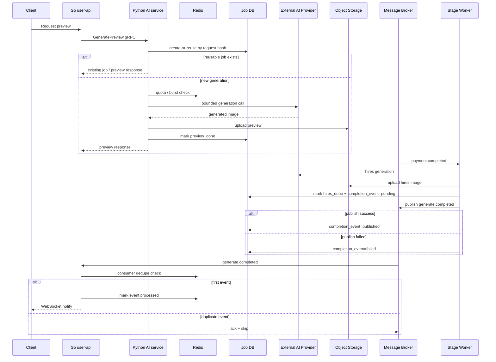

[← Back to portfolio README](../README.md)

# 외부 AI 모델 호출 백엔드 운영 안정화

> 공개 가능한 범위에서 일반화한 case study입니다. 실제 provider/model명, 내부 queue/table/endpoint/config 값, secret, 운영 트래픽 수치는 공개하지 않습니다.

---

## 1. Context

이 프로젝트는 사용자가 업로드한 이미지를 기반으로 외부 AI provider를 호출해 preview/hires 이미지를 생성하는 백엔드 흐름을 안정화한 사례입니다.

구조는 크게 Python gRPC 기반 AI service와 Go user-api로 나뉩니다. AI service는 external AI provider 호출, object storage 저장, message broker 기반 후속 stage 처리, job status 관리를 담당하고, user-api는 클라이언트 요청, gRPC 호출, HTTP error mapping, WebSocket completion notification을 담당합니다.

| Component | Role |
|---|---|
| Go user-api | 클라이언트 요청 처리, AI service gRPC 호출, WebSocket notification |
| Python AI service | preview/hires generation orchestration |
| External AI provider | 이미지 생성 모델 호출 |
| Object storage | 생성 이미지 저장 |
| Message broker | payment/completion event 전달 |
| Redis | quota, burst limit, consumer dedupe |
| Relational DB | job status, request hash, completion event 상태 저장 |

핵심 관점은 외부 AI provider를 단순 API가 아니라 지연, 실패, 재시도 비용, quota, duplicate generation을 동반하는 운영 dependency로 다뤘다는 점입니다.

---

## 2. Problem

초기 구조는 기능적으로 이미지를 생성할 수 있었지만, 운영 관점에서는 다음 문제가 남아 있었습니다.

| Problem | Risk |
|---|---|
| Provider latency | 동기 preview 요청이 gRPC worker를 오래 점유할 수 있음 |
| Retry cost | validation retry, provider retry가 비용성 호출 증가로 이어질 수 있음 |
| Duplicate generation | 동일 요청 반복 또는 동시 요청에서 중복 provider 호출 가능 |
| Quota absence | 비용이 발생하는 AI service 내부에 자체 quota 방어선이 부족함 |
| Raw error exposure | provider raw error, HTTP body, presigned URL, secret-like 값이 응답/DB에 노출될 수 있음 |
| Completion event publish failure | hires image는 생성됐지만 completion event가 downstream에 전달되지 않을 수 있음 |
| Duplicate completion event | manual recovery나 broker 재전달로 user-api가 같은 completion event를 여러 번 받을 수 있음 |
| Readiness / metrics gap | 살아 있음과 처리 가능 상태를 구분하기 어렵고, 비용성 호출 관찰이 부족함 |

---

## 3. Stabilization Timeline

개선은 한 번에 큰 구조를 갈아엎기보다, 운영 리스크가 큰 부분부터 단계적으로 진행했습니다.

| Step | Improvement | Purpose |
|---|---|---|
| 1 | Safe error mapping / production config fail-fast | 내부 정보 노출과 잘못된 production 기동 방지 |
| 2 | Preview timeout / retry budget | 동기 gRPC worker 점유와 무제한 retry 비용 제한 |
| 3 | Duplicate reuse / DB-level active idempotency | 동일 요청과 동시 요청의 중복 generation 방지 |
| 4 | Redis quota / provider billable metric | provider 호출 전 비용 방어와 비용성 호출 관찰 |
| 5 | RabbitMQ DLQ / hires retry stage split | 메시지 실패 추적과 불필요한 재생성 방지 |
| 6 | Completion event tracking / manual recovery | completion publish 실패를 DB에서 식별하고 수동 복구 가능하게 함 |
| 7 | user-api HTTP 429 mapping / consumer idempotency | quota 초과 계약과 at-least-once 이벤트 소비 안정화 |

---

## 4. Architecture

이 구조는 exactly-once delivery를 목표로 하지 않습니다. 대신 at-least-once delivery를 전제로 producer 쪽에서는 publish 실패를 추적하고, consumer 쪽에서는 중복 이벤트를 안전하게 흡수하도록 설계했습니다.

---

## 5. Key Decisions

| Decision | Problem | Approach | Tradeoff |
|---|---|---|---|
| 동기 preview를 즉시 비동기로 전환하지 않음 | 기존 client 계약을 크게 바꾸면 변경 범위가 커짐 | timeout/retry budget, hard max, cancellation check를 먼저 적용 | worker 점유 자체는 남음 |
| Safe error mapping | raw exception이 사용자 응답/DB에 노출될 수 있음 | safe error code/message와 내부 log detail 분리 | 운영 원인 파악은 log/metric correlation 필요 |
| Production config fail-fast | 빈 secret/dev fallback으로 기동될 수 있음 | production required env와 placeholder rejection 추가 | local dev 설정 관리 필요 |
| Provider retry budget | retry가 비용성 호출 증가로 이어질 수 있음 | validation/provider retry를 budget과 attempt limit 안에서 수행 | 일부 느린 성공 요청은 실패할 수 있음 |
| Request hash reuse | 동일 요청 반복으로 provider 호출이 반복될 수 있음 | user/photo/style/product spec 기반 request hash로 preview_done/processing 재사용 | force regenerate는 별도 계약 필요 |
| DB-level active idempotency | 동시 요청에서 best-effort 조회만으로는 중복 insert 가능 | active processing/preview_done에 partial unique index와 create-or-reuse 도입 | 만료 조건은 unique index에 직접 표현하기 어려움 |
| Redis quota / burst limit | AI service 내부 비용 방어선 부족 | 신규 generation 전 Redis quota와 burst limit 확인 | fixed-window / TTL 기반 한계 존재 |
| Provider billable metric | 요청 수만으로 실제 비용성 호출을 보기 어려움 | generation attempt 기준 billable counter 추가 | full billing reconciliation은 아님 |
| Hires retry stage split | upload/publish 실패가 provider 재생성으로 이어질 수 있음 | generation / download / upload / publish retry 범위 분리 | 상태 전이와 retry 정책이 복잡해짐 |
| Completion event tracking | publish 실패가 DB에 남지 않음 | completion_event_status, attempts, published_at, safe last_error 기록 | full outbox가 아니므로 자동 복구는 아님 |
| Manual recovery CLI | 실패 이벤트를 운영자가 재발행할 수 없음 | list, dry-run, job-id republish, force 옵션 제공 | operator action 필요 |
| Consumer idempotency | 중복 completion event가 WebSocket 중복 알림을 만들 수 있음 | Go user-api에서 Redis SETNX + TTL dedupe | TTL 이후 또는 Redis fail-open 중 중복 가능 |
| At-least-once 전제 | exactly-once는 현실적으로 과도함 | producer recovery + consumer idempotency로 중복을 흡수 | downstream도 idempotency를 이해해야 함 |

---

## 6. Verification

검증은 외부 서비스를 직접 호출하기보다 fake/mock 기반으로 실패 케이스를 재현하는 방식으로 진행했습니다.

| Area | Verification |
|---|---|
| Error sanitize | provider error, secret-like string, signed URL fragment가 응답/DB에 노출되지 않는지 테스트 |
| Timeout / retry | deadline 부족 시 provider 호출이 시작되지 않는지, retry가 budget 안에서 제한되는지 테스트 |
| Duplicate reuse | preview_done/processing 재사용 시 provider 호출과 quota 차감이 없는지 테스트 |
| DB-level idempotency | unique violation 후 기존 active job을 재조회하는 흐름 테스트 |
| Quota | quota exceeded / fail-closed 시 provider 호출 전 차단되는지 테스트 |
| Billable metric | preview/hires generation attempt 기준 metric이 증가하는지 테스트 |
| Hires retry split | R2 upload/publish 실패가 provider 재호출로 이어지지 않는지 테스트 |
| Completion recovery | publish 성공/실패 상태 기록, dry-run, republish, force 차단 테스트 |
| Consumer idempotency | 중복 generate.completed 이벤트가 notify 없이 ack + skip 되는지 테스트 |
| Quality gate | pytest, targeted go test, ruff, git diff check 기반 검증 |

정확한 운영 트래픽 수치나 성능 개선률은 공개하지 않습니다. 이 문서에서는 어떤 실패 경로를 식별하고 테스트 가능한 구조로 만들었는지에 초점을 둡니다.

---

## 7. Known Limitations

| Limitation | Why it remains |
|---|---|
| GeneratePreview는 여전히 동기 gRPC worker를 점유함 | API 계약을 크게 바꾸지 않고 budget 기반 안정화를 먼저 적용했기 때문 |
| Full outbox dispatcher는 아직 없음 | 현재는 completion event tracking + manual recovery 단계 |
| Manual recovery는 operator action이 필요함 | 자동 dispatcher/retry worker는 후속 개선 후보 |
| Redis quota는 fixed-window/TTL 기반 | Lua script나 sliding-window limiter는 후속 개선 후보 |
| Redis dedupe는 TTL 이후 중복 가능 | 영구 dedupe가 필요하면 DB processed_events table 또는 event_id가 필요 |
| Redis fail-open 중 duplicate notification 가능 | completion notify 유실보다 중복 알림을 더 낮은 위험으로 판단 |
| exactly-once delivery는 비목표 | at-least-once delivery + idempotent consumer를 전제로 설계 |
| provider abstraction/fallback은 아직 제한적 | 현재 핵심은 안정화와 비용 방어였고, 다중 provider routing은 후속 과제 |

---

## 8. What this case shows

이 case study가 보여주는 역량은 다음과 같습니다.

| 역량 | 설명 |
|---|---|
| External dependency control | 외부 AI provider를 비용과 장애가 있는 운영 dependency로 다룸 |
| Reliability engineering | timeout, retry, circuit breaker, DLQ, recovery, idempotency를 단계적으로 적용 |
| Cost guardrail | duplicate reuse, quota, billable metric으로 비용성 호출을 제어 |
| Event-driven design | completion event publish 실패와 중복 delivery를 producer/consumer 양쪽에서 다룸 |
| Cross-service contract | Python AI service와 Go user-api 사이의 실패 계약과 HTTP mapping을 정리 |
| Testability | 외부 provider/storage/broker/Redis를 mock/fake로 격리해 실패 케이스를 검증 |
| Tradeoff awareness | async preview, full outbox, exactly-once 같은 과한 개선을 즉시 도입하지 않고 단계적으로 분리 |
