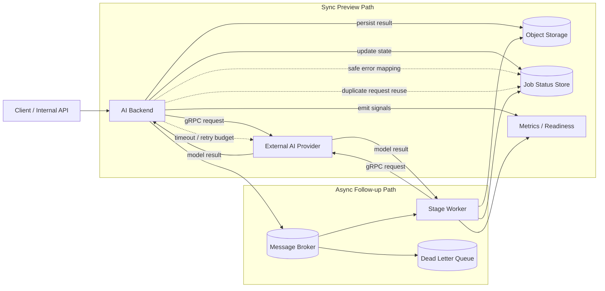

[← Back to Go Backend Reliability Case Studies](../README.md)

# 외부 AI 모델 호출 백엔드 운영 안정화

> 비공개 실서비스 준비 과정에서 수행한 외부 AI 이미지 생성 백엔드 안정화 경험을 일반화해 정리했습니다.  
> 실제 서비스명, 내부 프로젝트명, provider명, model명, queue/table/event/endpoint/proto 이름, 파일 경로, secret, credential, presigned URL, 정확한 timeout/retry 값은 공개하지 않습니다.

---

## 1. Summary

| 항목 | 내용 |
|---|---|
| 유형 | 비공개 실서비스 준비 백엔드 |
| 상태 | 비공개 서비스 준비 단계의 안정화 |
| 역할 | 호출 흐름 안정화, 오류 표준화, 후속 단계 분리, 운영 관찰성 보강 |
| 주요 기술 | Python, gRPC, Message Broker, Object Storage, job status store, metrics |
| 핵심 주제 | provider dependency, timeout/retry budget, duplicate request reuse, DLQ, readiness/liveness |

이 사례는 외부 AI 모델 호출을 기능 구현이 아니라 **비용과 장애를 동반하는 운영 dependency**로 다룬 작업입니다.  
핵심은 전체 구조를 비동기 preview job 중심으로 바꾸는 것이 아니라, 기존 동기 preview 흐름은 timeout/retry budget으로 worker 점유와 비용을 제한하고, 후속 고비용 생성 흐름만 message broker 기반 stage 분리로 다뤘다는 점입니다. generation / download / upload / publish의 실패 범위를 나누고, duplicate request reuse, DLQ 보장, safe error mapping, production config fail-fast, readiness/liveness 분리, metrics 보강을 우선순위대로 적용했습니다.

---

## 2. Disclosure

이 문서는 실제 서비스 준비 과정에서 수행한 비공개 백엔드 안정화 경험을 공개 가능한 범위 안에서 일반화한 내용입니다.

- 실제 서비스명, 내부 프로젝트명, provider명, model명은 공개하지 않았습니다.
- queue, topic, event, endpoint, proto, table, column, 파일 경로는 모두 일반화했습니다.
- timeout, retry budget, rate limit, concurrency 수치와 운영 임계값은 공개하지 않았습니다.
- secret, credential, presigned URL, 내부 운영 config 값은 제외했습니다.
- 설명은 구조, 판단 기준, 실패 격리 방식 위주로 정리했습니다.

---

## 3. Problem

초기 구조는 기능 중심의 AI 모델 호출 백엔드였습니다. 요청을 받으면 모델을 호출하고, 결과를 저장하고, 필요한 후속 처리를 이어가는 형태였지만 실서비스 준비 단계에서 운영 리스크가 명확해졌습니다.

다음 문제가 겹쳐 있었습니다.

- 장시간 모델 호출이 동기 RPC의 worker 점유로 이어질 수 있음
- provider timeout, network failure, transient error가 빈번히 발생할 수 있음
- retry가 무제한에 가깝게 열리면 비용이 빠르게 증가할 수 있음
- 동일 요청 반복으로 중복 생성 비용이 발생할 수 있음
- 내부 exception이나 provider raw error가 사용자 응답에 노출될 수 있음
- message 처리 실패 시 작업이 유실될 수 있음
- upload / publish 실패가 불필요한 재생성으로 이어질 수 있음
- production config 누락이나 placeholder 값으로도 기동될 위험이 있음
- readiness와 metrics가 약하면 운영 상태를 판단하기 어려움

문제의 핵심은 AI를 “호출할 수 있는 기능”으로 보는 것이 아니라, **외부 dependency로 인한 실패와 비용을 통제 가능한 백엔드 흐름으로 만드는 것**이었습니다.

---

## 4. My Role

제가 맡은 일은 AI 모델 호출 백엔드를 기능 단위로 더 만드는 것이 아니라, 운영 관점에서 다시 정리하는 것이었습니다.

- provider 호출을 단일 실패 지점으로 보지 않고 단계별로 분리
- 사용자 응답과 내부 오류 표현을 분리
- production 기동 조건을 명시적으로 검증
- retry와 duplicate reuse의 경계를 정의
- broker 기반 비동기 처리에서 실패 메시지가 사라지지 않도록 구조 보강
- readiness / liveness / metrics를 실제 운영 판단에 쓸 수 있게 정리

---

## 5. Approach

1. **Error sanitize**
   내부 exception과 provider raw error를 사용자에게 직접 노출하지 않도록 표준 오류 응답으로 매핑했습니다. 상세 원인은 로그와 metrics에서 추적하도록 분리했습니다.

2. **Production config fail-fast**
   빈 secret, placeholder, dev fallback이 production에서 그대로 동작하지 않도록 기동 시점 검증을 넣었습니다. 잘못된 설정은 늦게 발견하는 것보다 빨리 죽는 편이 낫다고 판단했습니다.

3. **Timeout / retry budget**
   긴 모델 호출이 worker를 무한 점유하지 않도록 timeout과 retry budget을 묶어서 관리했습니다. 재시도는 허용하되 무제한으로 열지 않았습니다.

4. **Duplicate request reuse**
   동일 요청이 반복될 때는 가능한 범위에서 기존 생성 결과를 재사용하도록 했습니다. full idempotency는 아니지만, 중복 생성 비용을 줄이는 실용적인 방어막이었습니다.

5. **DLQ 보장**
   message 처리 실패가 유실로 끝나지 않도록 DLQ를 보장했습니다. 운영자가 실패 작업을 추적하고 재처리 여부를 판단할 수 있어야 했습니다.

6. **Stage-based retry**
   generation, download, upload, publish를 분리하고 각 단계별 실패를 해당 단계에서만 재시도하도록 했습니다. 뒤 단계 실패가 앞 단계 재생성으로 번지지 않게 만들었습니다.

7. **Readiness / liveness 분리**
   살아 있음과 실제 서비스 가능 상태를 분리했습니다. 외부 dependency가 불안정할 때는 프로세스가 떠 있어도 트래픽을 받지 않도록 했습니다.

8. **Metrics 보강**
   provider 지연, 단계별 실패율, retry 패턴, DLQ 적재 여부를 운영 지표로 남겼습니다. 문제를 재현하지 않아도 상태를 볼 수 있어야 했습니다.

---

## 6. Architecture / Flow

### Component Map

| Component | Responsibility | Why it exists |
|---|---|---|
| `Client / Internal API` | 요청 진입점 | 외부/내부 호출의 시작점을 분리하기 위해 |
| `AI Backend` | 요청 검증, 단계 오케스트레이션, 오류 매핑 | model call을 운영 가능한 백엔드 흐름으로 감싸기 위해 |
| `Stage Worker` | generation / download / upload / publish 단계 실행 | 긴 작업을 한 번에 묶지 않고 실패 지점을 나누기 위해 |
| `External AI Provider` | 실제 모델 추론 수행 | 외부 dependency를 명시적으로 분리하기 위해 |
| `Object Storage` | 결과물 저장과 전달 매개체 | 생성 결과를 후속 단계와 분리해 다루기 위해 |
| `Message Broker` | 후속/고비용 작업 전달 | 동기 preview 흐름과 분리된 작업만 넘기고 실패 메시지를 DLQ로 추적 가능하게 하기 위해 |
| `Job Status Store` | 작업 상태 추적 | 운영자가 현재 상태와 실패 지점을 확인할 수 있게 하기 위해 |
| `Metrics / Readiness` | 헬스, 지연, 실패, 재시도 관찰 | 서비스 가능 상태를 운영 신호로 판단하기 위해 |

이 구조의 핵심은 provider 호출 자체보다, **동기 preview는 유지하되 후속/고비용 작업의 저장, 전달, 게시, 상태 추적을 별도 책임으로 나눴다**는 점입니다. 모든 preview 요청을 async job으로 전환한 것은 아닙니다.

---

## 7. Key Decisions

| Decision | Why | Trade-off |
|---|---|---|
| safe error mapping | 내부 error 노출 방지 | 상세 원인은 로그/metric으로 추적해야 함 |
| timeout/retry budget | worker 점유와 비용 폭증 제한 | 느린 요청은 더 빨리 실패할 수 있음 |
| duplicate request reuse | 동일 요청 반복 비용 완화 | full idempotency는 아님 |
| DLQ 보장 | 실패 메시지 추적 가능성 확보 | 운영 broker 설정과 맞아야 함 |
| stage-based retry | upload/publish 실패가 재생성으로 이어지는 비용 방지 | outbox 수준의 복구는 아님 |
| readiness/metrics | 운영 상태 판단 가능 | probe/metric 설계 주의 필요 |
| production config fail-fast | placeholder / dev fallback 기동 차단 | 잘못된 설정은 즉시 서비스 실패로 드러남 |

이 판단의 기준은 “완벽한 추상화”가 아니라, **운영 중 실제로 터지는 실패와 비용을 줄이는가**였습니다.

---

## 8. Before / After

| Before | After | Operational effect |
|---|---|---|
| 긴 모델 호출이 동기 preview 요청 안에 묶여 있었음 | 동기 preview 흐름에 bounded timeout / retry budget 적용 | preview를 async job으로 바꾸지 않고도 worker 점유 상한과 비용을 제한 |
| provider 에러와 내부 에러가 뒤섞여 있었음 | safe error mapping으로 응답 표준화 | 사용자 노출을 막고 운영 추적은 로그/metrics로 분리 |
| retry가 느슨하게 열려 있었음 | timeout / retry budget 적용 | 비용 폭증과 무한 재시도를 억제 |
| 반복 요청이 그대로 새 생성으로 이어질 수 있었음 | duplicate request reuse 적용 | 중복 생성 비용 완화 |
| 일부 message 실패가 묻힐 수 있었음 | DLQ 보장 | 실패 작업을 추적 가능 상태로 유지 |
| upload/publish 실패가 재생성을 유발할 수 있었음 | 후속 고비용 흐름에 generation / download / upload / publish stage-based retry 적용 | 후속 흐름에서 실패 범위를 좁히고 불필요한 재생성을 차단 |
| 기동 후에야 config 문제를 발견할 수 있었음 | production config fail-fast | 배포 실패를 더 일찍, 더 명확하게 드러냄 |
| 운영 상태를 감으로 판단해야 했음 | readiness / metrics 보강 | 서비스 가능 여부와 원인 파악이 쉬워짐 |

---

## 9. What I intentionally did not do

| Not done | Why it was deferred |
|---|---|
| full idempotency with unique constraint | 요청 의미와 중복 판단 기준이 아직 유동적이어서, 먼저 best-effort reuse로 비용과 복잡도의 균형을 맞추는 편이 맞았습니다. |
| full quota/billing system | 비용 정산 체계를 넓히기보다, 현재 단계에서 먼저 호출 폭주와 실패 격리를 안정화하는 쪽이 우선이었습니다. |
| outbox pattern | 현재 문제는 메시지 발행 전체의 일관성보다, 작업 단위 실패를 분리하고 DLQ로 관찰 가능하게 만드는 것이 더 급했습니다. |
| async preview job 전환 | preview까지 모두 비동기로 바꾸면 경험과 복잡도가 같이 커지므로, 우선 동기 흐름을 안정화하는 쪽을 선택했습니다. |
| workflow engine | 오케스트레이션 엔진을 넣는 것보다, 현재 단계의 실패 지점과 재시도 범위를 명확히 나누는 편이 더 직접적이었습니다. |
| multi-provider routing | provider 전환 유연성은 이후 확장 포인트로 두고, 지금은 단일 provider dependency를 운영 가능하게 만드는 데 집중했습니다. |
| OpenTelemetry tracing | tracing을 먼저 도입하기보다 probe, metrics, error mapping으로 운영 기준선을 세우는 편이 현재 단계에 더 맞았습니다. |

---

## 10. Result

정량 수치를 과장하지 않고 말하면, 이 작업의 결과는 다음과 같습니다.

- 외부 AI provider 호출이 단순 API 연동이 아니라 운영 dependency로 분리되었습니다.
- 실패가 사용자 응답, worker 점유, message 처리, 저장 단계로 섞이지 않게 됐습니다.
- 재시도와 중복 생성의 비용을 운영 가능한 범위로 줄일 수 있는 구조를 만들었습니다.
- production 기동 조건과 서비스 가능 상태를 명확히 나눴습니다.
- 문제를 발견했을 때 어디서 터졌는지 확인할 수 있는 관찰성이 생겼습니다.

즉, AI 기능을 “붙였다”가 아니라 **외부 모델 호출을 운영 가능한 백엔드 흐름으로 안정화했다**는 것이 이 사례의 결과입니다.

---

## 11. What this shows

이 사례가 보여주는 역량은 다음과 같습니다.

- 외부 dependency 실패를 고려한 backend reliability 설계
- 비용이 발생하는 retry를 제어하는 판단
- 메시지 기반 비동기 흐름에서 실패 격리
- 운영 가능한 health/metrics 설계
- 공개할 수 없는 실서비스 경험을 안전하게 일반화하는 문서화 역량

---

[← Back to Go Backend Reliability Case Studies](../README.md)
