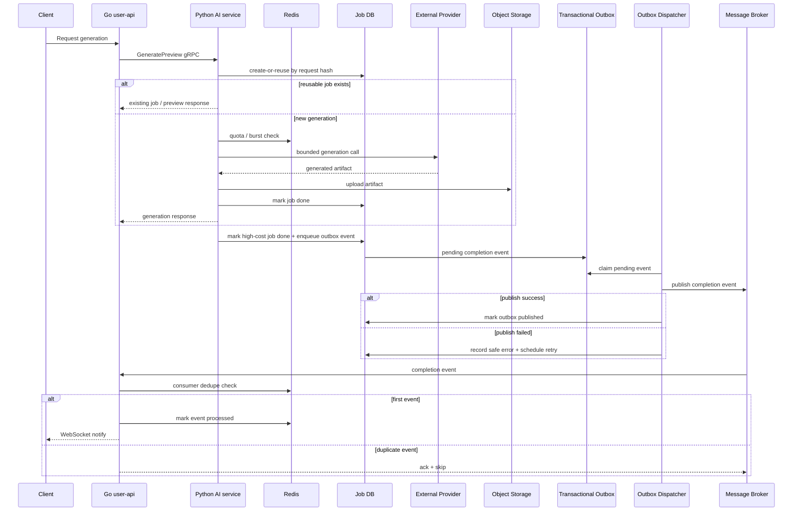

[← Back to portfolio README](../README.md)

# 외부 비용성 Provider 연동 백엔드 안정화

> 공개 가능한 범위에서 일반화한 case study입니다.
>
> 실제 프로젝트명, 핵심 서비스 도메인, provider/model명, 내부 queue/table/endpoint/config 값, secret, 운영 트래픽 수치는 공개하지 않습니다.

---

## TL;DR

외부 provider 연동을 단순 API 호출 문제가 아니라, **비용성 dependency를 포함한 분산 백엔드 신뢰성 문제**로 재정의한 사례입니다.

| Focus | What changed |
|---|---|
| Cost Guardrail | duplicate reuse, Redis quota/burst guard, billable attempt metric으로 비용성 호출을 제어 |
| Duplicate Suppression | request hash, active partial uniqueness, downstream claim으로 중복 generation 시작을 억제 |
| Failure Boundary | generation / download / upload / publish retry 경계를 분리해 불필요한 provider 재호출을 줄임 |
| Event Reliability | completion event를 transactional outbox에 기록하고 dispatcher가 publish / retry / status tracking 수행 |
| Consumer Idempotency | Go user-api consumer에서 Redis SETNX + TTL dedupe로 중복 completion event를 ack + skip |
| Observability | readiness, provider/quota/outbox/consumer metric으로 운영 관찰 지점 확보 |

---

## 1. Context

이 프로젝트는 사용자가 요청한 생성 작업을 처리하기 위해 외부 비용성 provider를 호출하고, 생성 결과를 저장한 뒤 downstream 서비스에 completion event를 전달하는 백엔드 흐름을 안정화한 사례입니다.

구조는 크게 **Python gRPC 기반 AI service**와 **Go user-api**로 나뉩니다.

| Component | Role |
|---|---|
| Go user-api | 클라이언트 요청 처리, AI service gRPC 호출, HTTP error mapping, WebSocket notification |
| Python AI service | generation orchestration, provider 호출, artifact 저장, job 상태 관리 |
| External provider | 비용이 발생할 수 있는 생성 요청 처리 |
| Object storage | 생성 artifact 저장 |
| Message broker | downstream completion event 전달 |
| Redis | quota, burst limit, consumer dedupe |
| Relational DB | job status, request hash, outbox event, publish 상태 저장 |

핵심 관점은 외부 provider를 단순 API가 아니라 **지연, 실패, 재시도 비용, quota, duplicate generation을 동반하는 운영 dependency**로 다뤘다는 점입니다.

---

## 2. Problem

초기 구조는 기능적으로 생성 요청을 처리할 수 있었지만, 운영 관점에서는 다음 문제가 남아 있었습니다.

| Problem | Risk |
|---|---|
| Provider latency | 동기 요청이 gRPC worker를 오래 점유할 수 있음 |
| Retry cost | validation retry, provider retry가 비용성 호출 증가로 이어질 수 있음 |
| Duplicate generation | 동일 요청 반복 또는 동시 요청에서 중복 provider 호출 가능 |
| Quota absence | 비용이 발생하는 AI service 내부에 자체 quota 방어선이 부족함 |
| Raw error exposure | provider raw error, HTTP body, signed URL, secret-like 값이 응답/DB에 노출될 수 있음 |
| Publish failure after generation | 생성 결과는 저장됐지만 completion event가 downstream에 전달되지 않을 수 있음 |
| Duplicate completion event | recovery나 broker 재전달로 user-api가 같은 completion event를 여러 번 받을 수 있음 |
| Readiness / metrics gap | 살아 있음과 처리 가능 상태를 구분하기 어렵고, 비용성 호출 관찰이 부족함 |

---

## 3. Reliability Strategy

개선은 한 번에 큰 구조를 갈아엎기보다, 운영 리스크가 큰 부분부터 단계적으로 진행했습니다.

| Risk | Strategy | Result |
|---|---|---|
| Provider latency / retry cost | deadline-aware budget, bounded retry, hard cap, cancellation check | 동기 요청의 worker 점유와 비용성 retry를 제한 |
| Duplicate generation | request hash reuse, active 상태 partial uniqueness, downstream claim | 동일/동시 요청에서 중복 provider 호출을 억제 |
| Cost overrun | Redis quota / burst guard, billable attempt metric | 신규 generation 진입 전 비용 방어선과 관측 지점 확보 |
| Publish failure after generation | transactional outbox, dispatcher retry, status tracking | 생성 완료와 completion event 발행 사이의 불일치를 복구 가능한 상태로 전환 |
| Duplicate completion delivery | Redis SETNX + TTL consumer dedupe | at-least-once delivery에서 중복 사용자 알림을 억제 |
| Unsafe production behavior | production config fail-fast, safe error mapping | placeholder secret, dev fallback, raw provider error 노출 위험 감소 |
| Observability gap | readiness check, provider/quota/outbox/consumer metrics | 장애 위치와 비용성 호출 흐름을 운영 관점에서 관찰 가능하게 함 |

---

## 4. Architecture

이 구조는 exactly-once delivery를 목표로 하지 않습니다.

대신 **at-least-once delivery**를 전제로 producer 쪽에서는 outbox uniqueness, publish retry, status tracking으로 실패를 관찰 가능하게 만들고, consumer 쪽에서는 Redis TTL 기반 dedupe로 중복 이벤트를 흡수하도록 설계했습니다.

---

## 5. Key Decisions

| Decision | Problem | Approach | Tradeoff |
|---|---|---|---|
| 동기 요청을 즉시 비동기로 전환하지 않음 | 기존 client 계약을 크게 바꾸면 변경 범위가 커짐 | timeout/retry budget, hard max, cancellation check를 먼저 적용 | worker 점유 자체는 남음 |
| Safe error mapping | raw exception이 사용자 응답/DB에 노출될 수 있음 | safe error code/message와 내부 log detail 분리 | 운영 원인 파악은 log/metric correlation 필요 |
| Production config fail-fast | 빈 secret/dev fallback으로 기동될 수 있음 | production required env와 placeholder rejection 추가 | local dev 설정 관리 필요 |
| Provider retry budget | retry가 비용성 호출 증가로 이어질 수 있음 | validation/provider retry를 budget과 attempt limit 안에서 수행 | 일부 느린 성공 요청은 실패할 수 있음 |
| Request hash reuse | 동일 요청 반복으로 provider 호출이 반복될 수 있음 | user/input/style/spec 기반 request hash로 active job 재사용 | force regenerate는 별도 계약 필요 |
| DB-level duplicate suppression | 동시 요청에서 best-effort 조회만으로는 중복 insert 가능 | active 상태 partial unique index와 create-or-reuse 도입 | 범용 external idempotency-key API는 아님 |
| Redis quota / burst limit | AI service 내부 비용 방어선 부족 | 신규 preview generation 전 Redis quota와 burst limit 확인 | fixed-window / TTL 기반 한계 존재 |
| Provider billable metric | 요청 수만으로 실제 비용성 호출을 보기 어려움 | generation attempt 기준 billable counter 추가 | full billing reconciliation은 아님 |
| Retry boundary 분리 | download/upload/publish 실패가 provider 재호출로 이어질 수 있음 | generation / download / upload / publish retry 범위 분리 | 상태 전이와 retry 정책이 복잡해짐 |
| Transactional outbox | 생성 완료 후 event publish 실패가 유실될 수 있음 | completion event를 DB outbox에 적재하고 dispatcher가 publish/retry/status tracking 수행 | dispatcher 실행 방식과 배포 wiring을 관리해야 함 |
| Manual recovery CLI | terminal failure를 운영자가 점검·재전송할 수 있어야 함 | list, dry-run, job-id republish, force 옵션 제공 | operator action이 필요한 경로가 남음 |
| Consumer idempotency | 중복 completion event가 WebSocket 중복 알림을 만들 수 있음 | Go user-api에서 Redis SETNX + TTL dedupe | TTL 이후 또는 Redis fail-open 중 중복 가능 |
| At-least-once 전제 | exactly-once는 현실적으로 과도함 | producer outbox + consumer dedupe로 중복을 흡수 | downstream도 idempotency를 이해해야 함 |

---

## 6. Verification

검증은 외부 서비스를 직접 호출하기보다 fake/mock 기반으로 실패 케이스를 재현하는 방식으로 진행했습니다.

| Area | Verification |
|---|---|
| Error sanitize | provider error, secret-like string, signed URL fragment가 응답/DB에 노출되지 않는지 테스트 |
| Timeout / retry | deadline 부족 시 provider 호출이 시작되지 않는지, retry가 budget 안에서 제한되는지 테스트 |
| Duplicate reuse | active job 재사용 시 provider 호출과 quota 차감이 없는지 테스트 |
| DB-level duplicate suppression | unique violation 후 기존 active job을 재조회하는 흐름 테스트 |
| Quota | quota exceeded / fail-closed 시 provider 호출 전 차단되는지 테스트 |
| Billable metric | generation attempt 기준 metric이 증가하는지 테스트 |
| Retry boundary | download/upload 실패가 provider 재호출로 이어지지 않는지 테스트 |
| Outbox dispatcher | pending event claim, publish, retry schedule, terminal failure, stale lock recovery 테스트 |
| Recovery CLI | dry-run, republish, already-published force guard 테스트 |
| Consumer idempotency | 중복 completion event가 notify 없이 ack + skip 되는지 테스트 |
| Quality gate | targeted pytest, targeted go test, diff check 기반 검증 |

정확한 운영 트래픽 수치나 성능 개선률은 공개하지 않습니다.

이 문서에서는 어떤 실패 경로를 식별하고 테스트 가능한 구조로 만들었는지에 초점을 둡니다.

---

## 7. Known Limitations

| Limitation | Why it remains |
|---|---|
| 동기 generation 요청은 여전히 gRPC worker를 점유함 | API 계약을 크게 바꾸지 않고 budget 기반 안정화를 먼저 적용했기 때문 |
| Outbox dispatcher는 현재 AI process 내부 background worker로 동작함 | completion event 범위의 transactional outbox, publish retry, status tracking은 구현했지만, 독립 실행 프로세스나 별도 worker deployment로 분리할지는 배포 전략에 따라 추가 정비가 필요함 |
| Manual recovery CLI는 여전히 필요함 | 자동 retry 이후 terminal failure, 운영 점검, 강제 재전송을 위해 dry-run / republish / force 경로를 남겼음 |
| Redis quota는 fixed-window/TTL 기반 | strict atomic cap이나 sliding-window limiter가 필요한 경우 별도 개선이 필요함 |
| Redis dedupe는 TTL 이후 중복 가능 | 영구 dedupe가 필요하면 DB processed_events table 또는 event_id 기반 장기 저장소가 필요함 |
| Redis dedupe fail-open 중 duplicate notification 가능 | completion notify 유실보다 중복 알림을 더 낮은 위험으로 판단했기 때문 |
| exactly-once delivery는 비목표 | at-least-once delivery + producer outbox + idempotent consumer를 전제로 설계 |
| 일부 durable consume 경로와 completion publish failure 추적 방식이 다름 | 일부 consume 경로는 DLQ로 추적하고, completion publish failure는 DB outbox 상태와 recovery workflow로 추적함 |
| readiness/liveness의 배포 probe semantic은 추가 정비 대상 | AI service 내부 health contract는 분리했지만, 배포 manifest의 probe 설정까지 완전히 같은 의미로 분리하려면 추가 정비가 필요함 |
| provider abstraction/fallback은 제한적 | 현재 핵심은 안정화와 비용 방어였고, 다중 provider routing은 별도 문제로 남겼음 |

---

## 8. What this case shows

| 역량 | 설명 |
|---|---|
| External dependency control | 외부 provider를 비용과 장애가 있는 운영 dependency로 다룸 |
| Reliability engineering | timeout, retry, duplicate suppression, outbox, recovery, idempotency를 단계적으로 적용 |
| Cost guardrail | duplicate reuse, quota, billable metric으로 비용성 호출을 제어 |
| Event-driven design | completion event publish 실패와 중복 delivery를 producer/consumer 양쪽에서 다룸 |
| Cross-service contract | Python AI service와 Go user-api 사이의 실패 계약과 HTTP mapping을 정리 |
| Testability | 외부 provider/storage/broker/Redis를 mock/fake로 격리해 실패 케이스를 검증 |
| Tradeoff awareness | async 전환, exactly-once, strict quota cap 같은 과한 개선을 즉시 도입하지 않고 현재 리스크에 맞게 단계적으로 분리 |

---

## 9. Summary

이 사례의 핵심은 외부 provider 연동을 단순 API 호출 문제가 아니라, 비용성 dependency를 포함한 분산 백엔드 신뢰성 문제로 재정의한 점입니다.

동기 generation 경로에는 deadline-aware budget과 quota guard를 적용하고, 후속 고비용 generation / completion 경로는 중복 claim, 단계별 retry boundary, transactional outbox, consumer dedupe로 나누어 안정화했습니다.

이를 통해 provider timeout, 중복 생성, publish 실패, at-least-once delivery에서 발생할 수 있는 운영 리스크를 코드와 테스트로 검증 가능한 구조로 정리했습니다.
