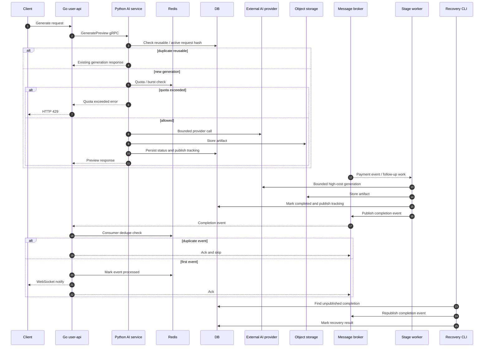

[← Back to Go Backend Reliability Case Studies](../README.md)

# 외부 AI 모델 호출 백엔드 운영 안정화

> 비공개 실서비스 준비 과정에서 수행한 외부 AI 이미지 생성 백엔드 안정화 경험을 일반화해 정리했습니다.
>
> 실제 서비스명, 내부 프로젝트명, provider명, model명, queue/table/event/endpoint/proto 이름, 파일 경로, secret, credential, presigned URL, 정확한 timeout/retry/quota 값은 공개하지 않습니다.

---

## 1. Context

이 사례는 **Python gRPC AI service**와 **Go user-api**가 연동되는 이미지 생성 backend를 실서비스 준비 수준으로 안정화한 작업입니다.

구조는 공개 가능한 범위에서 다음처럼 일반화할 수 있습니다.

| Component | Role |
|---|---|
| Go user-api | 사용자 요청 진입점, gRPC 호출, HTTP error mapping, completion event consumer |
| Python AI service | generation 요청 검증, provider 호출, artifact 저장, 상태 추적, completion event publish |
| External AI provider | 비용이 발생하는 이미지 생성 dependency |
| Object storage | 생성 결과물 저장 |
| Message broker | 후속 generation stage와 completion event 전달 |
| Redis | quota/burst limit, consumer event dedupe |
| Relational DB | job 상태, request hash 기반 active uniqueness, completion publish tracking |

핵심은 AI provider를 단순 API가 아니라 **지연, 실패, 비용을 가진 외부 dependency**로 보고, Python AI service와 Go user-api 사이의 실패 계약까지 함께 정리한 점입니다.

---

## 2. Problem

초기 구조는 기능 중심의 이미지 생성 흐름이었고, 실서비스 준비 단계에서 다음 운영 리스크가 드러났습니다.

- provider latency가 동기 gRPC worker 점유로 이어질 수 있음
- retry가 비용성 provider 호출을 반복할 수 있음
- 동일 요청 또는 동시 요청이 duplicate generation을 만들 수 있음
- 신규 generation quota가 없으면 트래픽 급증이 provider 비용으로 바로 전이될 수 있음
- 내부 exception이나 provider raw error가 사용자 응답에 노출될 수 있음
- completion event publish 실패 시 생성은 완료됐지만 downstream 반영이 누락될 수 있음
- at-least-once delivery 환경에서 duplicate completion event가 반복 처리될 수 있음
- readiness와 metrics가 약하면 장애 원인과 서비스 가능 상태를 판단하기 어려움

문제의 중심은 “이미지를 생성할 수 있는가”가 아니라, **실패와 비용을 예측 가능한 backend 흐름으로 제한할 수 있는가**였습니다.

---

## 3. Stabilization Timeline

| Step | Stabilization |
|---|---|
| 1 | safe error mapping과 production config fail-fast를 먼저 적용해 raw error 노출과 잘못된 production 기동을 차단 |
| 2 | preview timeout/retry budget을 두어 동기 gRPC worker 점유와 provider retry 비용을 제한 |
| 3 | duplicate request reuse를 넣고, 이후 request hash 기반 DB-level active idempotency로 동시 duplicate generation을 방어 |
| 4 | Redis quota/burst limit으로 신규 generation을 provider 호출 전에 차단하고 provider billable metric으로 비용성 호출을 관찰 |
| 5 | message broker DLQ와 hires retry stage split으로 generation / download / upload / publish 실패 범위를 분리 |
| 6 | completion event publish tracking과 manual recovery CLI로 완료 이벤트 발행 실패를 복구 가능한 상태로 전환 |
| 7 | Go user-api에서 AI service의 quota 초과 응답을 HTTP 429로 매핑하고, Redis dedupe로 duplicate completion event를 ack + skip 처리 |

각 단계는 큰 구조 개편보다, 실제 운영에서 비용과 장애로 이어지는 경로를 하나씩 닫는 방향으로 진행했습니다.

---

## 4. Architecture

이 구조에서 `GeneratePreview`는 아직 동기 gRPC worker를 점유합니다.

대신 timeout/retry budget, quota, idempotency, safe error mapping으로 동기 경로의 위험을 제한하고, 후속 고비용 작업과 completion event는 broker와 recovery 흐름으로 분리했습니다.

---

## 5. Key Decisions

| Decision | Problem | Approach | Tradeoff |
|---|---|---|---|
| 동기 preview를 즉시 비동기로 갈아엎지 않음 | preview UX와 구조 변경 비용이 큼 | timeout/retry budget으로 worker 점유와 provider 호출 시간을 먼저 제한 | worker 점유 자체는 남아 있음 |
| provider retry와 validation retry를 비용 관점에서 제한 | retry가 비용성 provider 호출을 반복할 수 있음 | provider billable call을 관찰하고 retry budget을 분리 | 느린 요청은 더 빨리 실패할 수 있음 |
| duplicate reuse와 DB-level active uniqueness | 동일 또는 동시 요청이 duplicate generation을 만들 수 있음 | request hash로 재사용 후보를 찾고 active generation uniqueness를 DB에서 방어 | request hash 기준이 바뀌면 migration과 호환성 고려 필요 |
| Redis quota와 provider billable metric | 트래픽 급증이 provider 비용으로 바로 전이될 수 있음 | provider 호출 전에 quota/burst limit을 확인하고 비용성 호출 metric을 분리 | Redis TTL/fixed-window 특성의 근사치가 있음 |
| completion event tracking과 manual recovery | 완료 저장 후 event publish 실패가 downstream 누락으로 이어질 수 있음 | publish 상태를 남기고 recovery CLI로 미발행 완료 이벤트를 재발행 | operator action이 필요하고 full dispatcher는 아님 |
| Go user-api consumer idempotency | at-least-once delivery에서 duplicate event가 반복 처리될 수 있음 | Redis dedupe로 중복 completion event를 ack + skip | TTL 이후 매우 늦은 duplicate는 별도 정책 필요 |
| exactly-once가 아니라 at-least-once + idempotent consumer를 전제로 설계 | broker와 network 경계에서 exactly-once를 보장하기 어려움 | 중복 수신을 정상 시나리오로 보고 consumer side effect를 멱등화 | producer/consumer 양쪽의 상태 추적이 필요 |
| safe error mapping과 production config fail-fast | raw error 노출과 잘못된 설정 기동 위험 | 공개 응답과 내부 원인을 분리하고 production 필수 설정을 기동 시 검증 | 설정 오류는 배포 시 즉시 실패로 드러남 |

판단 기준은 “완벽한 분산 트랜잭션”이 아니라, **실제 운영에서 자주 발생할 비용, 중복, event 누락을 추적 가능하고 복구 가능한 형태로 제한하는가**였습니다.

---

## 6. Verification

검증은 외부 provider, object storage, broker, Redis를 fake/mock으로 격리해 수행했습니다.

정확한 테스트 개수는 공개하지 않고, 검증 관점만 일반화해 정리합니다.

| Area | Verification |
|---|---|
| Python AI service | pytest 기반으로 timeout/retry, duplicate reuse, quota, provider billable metric, completion publish tracking, recovery 흐름을 검증 |
| Go user-api | targeted go test로 quota 초과 응답의 HTTP 429 mapping과 completion event consumer idempotency를 검증 |
| Error exposure | raw provider error, 내부 exception, secret-like string이 사용자 응답에 노출되지 않는지 검증 |
| External dependency isolation | provider/storage/broker/Redis 실패를 fake/mock으로 재현해 stage별 실패 범위를 검증 |
| Formatting and checks | ruff, targeted go test, git diff check로 문법, 테스트, 의도하지 않은 변경을 확인 |

테스트의 목적은 성공 경로보다, duplicate / quota / recovery / idempotency처럼 운영 중 비용이나 상태 불일치로 이어지는 경계를 재현하는 것이었습니다.

---

## 7. Known Limitations

| Limitation | Why it matters |
|---|---|
| GeneratePreview는 아직 동기 gRPC worker를 점유함 | timeout/retry budget으로 제한했지만, 구조적으로 worker 점유가 사라진 것은 아님 |
| full outbox dispatcher는 아직 없음 | completion publish tracking과 manual recovery는 복구 수단이지 완전한 자동 dispatcher가 아님 |
| manual recovery는 operator action 필요 | 미발행 completion event를 복구하려면 운영자가 CLI를 실행해야 함 |
| Redis quota/dedupe는 TTL/fixed-window 기반 한계가 있음 | sliding window, distributed counter 정확성, 매우 늦은 duplicate 처리에는 추가 설계가 필요함 |
| Redis dedupe 장애 중 fail-open 정책으로 duplicate notification이 가능할 수 있음 | 중복 알림보다 완료 알림 유실을 더 큰 리스크로 보고 의도적으로 fail-open을 선택함 |
| exactly-once delivery는 비목표 | at-least-once delivery와 idempotent consumer를 현실적인 전제로 둠 |
| provider abstraction/fallback은 후속 개선 후보 | 단일 provider dependency를 먼저 안정화했고, multi-provider routing은 별도 과제로 남김 |

이 한계들은 숨긴 것이 아니라, 현재 단계에서 의도적으로 둔 경계입니다.

먼저 비용과 장애가 크게 번지는 경로를 제한하고, 이후 full outbox dispatcher나 provider fallback 같은 구조 개선을 검토할 수 있게 만들었습니다.

---

## 8. What this case shows

이 사례가 보여주는 역량은 다음과 같습니다.

- 외부 AI provider를 비용과 장애를 가진 dependency로 다루는 관점
- 모델 호출 백엔드의 timeout/retry/cost/idempotency/event recovery 설계
- Python AI service와 Go user-api 사이의 실패 계약 정리
- at-least-once event handling과 consumer idempotency 이해
- 테스트 가능한 구조로 외부 의존성 실패를 검증하는 방식
- 공개할 수 없는 실서비스 경험을 secret, provider, 내부 queue/table/endpoint/config 없이 일반화하는 문서화

---

[← Back to Go Backend Reliability Case Studies](../README.md)
