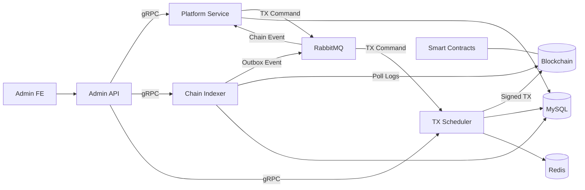
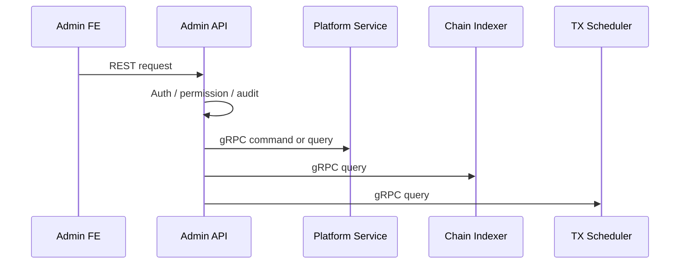
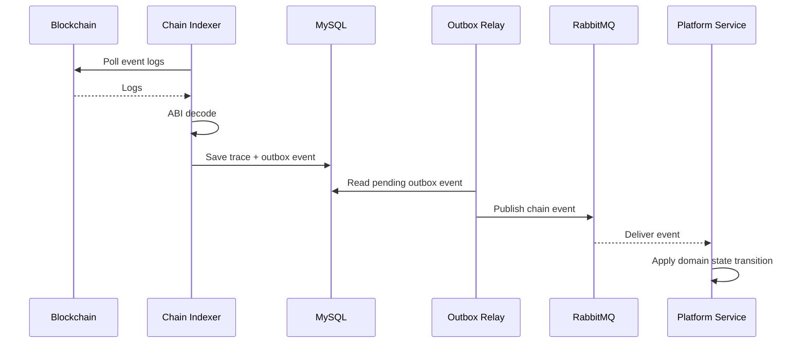
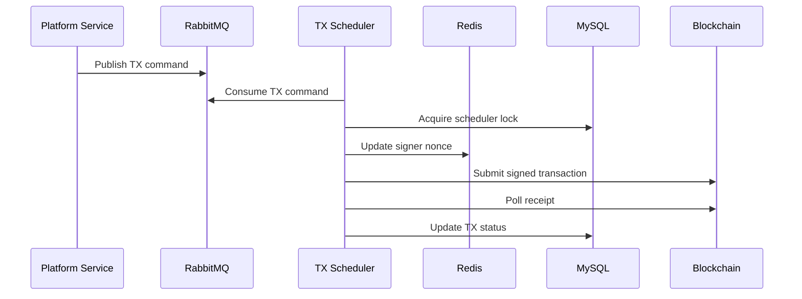

[← Back to Go Backend Case Studies](../README.md)

# 온체인 예측 시장 백엔드 플랫폼 설계 및 개발

> 실서비스로 운영 중인 온체인 예측 시장에서 백엔드 실행 단위, 컨트랙트 연동, 운영 도구를 설계하고 개발했습니다.  
> 공개 문서에서는 실제 서비스명, 내부 코드명, secret, 사설 인프라 정보, 감사 보고서 세부 내용은 제외하거나 일반화했습니다.

---

## 1. Summary

| 항목 | 내용 |
|---|---|
| 유형 | 실무 서비스 / 운영 중 |
| 기간 | 2026.02 ~ 진행 중 |
| 역할 | 전체 기능 구조 및 모듈 경계 설계, 주요 백엔드 컴포넌트 개발 |
| 주요 기술 | Go, gRPC, RabbitMQ, MySQL, Redis, Solidity, Foundry, Next.js |
| 구성 | Go 백엔드 4종 + 관리자 UI + Solidity 컨트랙트 모듈 |
| 핵심 주제 | 서비스 경계 설계, 온체인 이벤트 처리, TX 제출 일원화, 운영 검증 흐름 |

이 프로젝트는 단순한 CRUD 백엔드가 아니라, **온체인 컨트랙트와 오프체인 백엔드가 함께 동작하는 실서비스 백엔드 플랫폼을 설계한 사례**입니다.

핵심 과제는 여러 백엔드 컴포넌트의 책임을 나누고, 관리자 요청·도메인 처리·체인 이벤트 수집·온체인 트랜잭션 제출을 안정적으로 연결하는 것이었습니다. 특히 DB 저장과 메시지 발행 사이의 불일치, 여러 서비스가 직접 TX를 제출할 때 발생하는 nonce/retry/gas 문제, 다중 인스턴스 운영 시 실행 책임 충돌 가능성을 구조적으로 줄이는 데 집중했습니다.

---

## 2. Context / Problem

온체인 예측 시장은 일반적인 백엔드 서비스보다 상태 경계가 복잡합니다. 일부 상태는 오프체인 DB에서 관리되지만, 정산이나 청구 가능 상태처럼 신뢰가 필요한 영역은 컨트랙트와 연결됩니다. 따라서 백엔드는 단순히 API 요청을 처리하는 것뿐 아니라 체인 이벤트를 수집하고, 도메인 상태로 반영하고, 필요한 온체인 트랜잭션을 제출해야 합니다.

이 과정에서 다음 문제가 있었습니다.

- 여러 백엔드 컴포넌트의 책임을 어디서 나눌 것인가
- 외부 REST API와 내부 서비스 계약을 어떻게 분리할 것인가
- 체인 이벤트 수집, DB 저장, 메시지 발행 사이의 실패 가능성을 어떻게 줄일 것인가
- 여러 서비스가 직접 온체인 TX를 제출할 때 발생하는 nonce, retry, gas 문제를 어떻게 제어할 것인가
- 동일 코드베이스를 여러 실행 인스턴스로 운영할 때 lock scope와 실행 책임을 어떻게 분리할 것인가
- 빠른 구현 과정에서도 설계 의도와 검증 기준을 어떻게 유지할 것인가

이 프로젝트의 목표는 기능을 빠르게 추가하는 것에 그치지 않고, **온체인/오프체인 경계에서 발생하는 실패 가능성을 책임 단위로 분리하고 추적 가능한 구조로 만드는 것**이었습니다.

---

## 3. My Role

이 프로젝트에서 저는 단일 기능 개발자가 아니라, 온체인 예측 시장을 구성하는 백엔드 실행 단위와 운영 흐름을 설계하고 주요 컴포넌트를 구현했습니다.

핵심 역할은 세 가지였습니다.

1. **서비스 경계 설계**
   - `platform-service`, `admin-api`, `chain-indexer`, `tx-scheduler`의 책임 분리
   - REST / gRPC / AMQP 통신 경계 정의
   - 관리자 요청과 내부 도메인 명령의 진입점 분리

2. **온체인/오프체인 연동 구조 구현**
   - `chain-indexer` 기반 체인 이벤트 수집 및 ABI 디코딩
   - Outbox Pattern 기반 이벤트 저장/발행 구조 설계
   - `tx-scheduler` 기반 온체인 TX 제출 일원화

3. **운영 가능한 개발 프로세스 정리**
   - EDD(구현 전 요구사항, 경계, 실패 시나리오, 검증 기준을 정리하는 설계 문서화 방식) 도입
   - 실패 시나리오, 검증 기준, 운영 제약을 구현 전에 정리
   - 다중 인스턴스 실행 구조와 lock scope 기준 정리

---

## 4. Architecture / Workflow



관리자 API는 외부 요청의 진입점 역할을 하고, 내부 명령과 조회는 gRPC를 통해 각 서비스로 위임합니다. 체인 이벤트는 `chain-indexer`가 수집한 뒤 Outbox와 AMQP를 거쳐 `platform-service`에 반영되며, 온체인 TX 제출은 `tx-scheduler`로 집중시켰습니다.

### Component Map

| Component | Responsibility | Why it exists |
|---|---|---|
| `platform-service` | 마켓, 정산, 포지션, 수수료 등 핵심 도메인 처리 | 강하게 결합된 도메인 흐름을 일관성 있게 처리하기 위해 |
| `admin-api` | 운영자 REST API, 인증, 권한, 감사 로그 | 운영자 명령을 검증하고 내부 서비스 호출로 연결하기 위해 |
| `chain-indexer` | 온체인 이벤트 수집, ABI 디코딩, Outbox 발행 | 블록체인 이벤트를 오프체인 도메인 이벤트로 변환하기 위해 |
| `tx-scheduler` | 온체인 TX 제출, nonce, retry, gas, receipt 관리 | 여러 서비스의 직접 TX 제출을 막고 제출 책임을 일원화하기 위해 |
| `admin-fe` | 관리자 UI | 운영자가 마켓, 정산, 상태를 확인하고 제어하기 위해 |
| `smart contracts` | 온체인 상태, 정산, 청구 가능 상태 관리 | 신뢰가 필요한 상태를 온체인 경계에 두기 위해 |

이 구조는 완전한 MSA라고 단정하기보다, **하나의 실서비스를 책임별 실행 단위로 분리한 모듈러 백엔드 구조**에 가깝습니다.

---

## 5. Key Decisions

### 5.1 gRPC 기반 내부 서비스 계약 도입

관리자 API는 단순히 DB를 조회하는 서버가 아니라, 운영자 요청을 받아 핵심 도메인 서비스, 체인 인덱서, 트랜잭션 스케줄러에 내부 명령과 조회를 전달해야 했습니다.

모든 내부 통신을 REST로 구성할 수도 있었지만, 내부 서비스 간 요청/응답 구조가 늘어날수록 endpoint 추적, 타입 변경 영향 범위 파악, 외부 API와 내부 계약의 경계 유지가 어려워질 수 있다고 판단했습니다.

그래서 외부 관리자 화면과 `admin-api` 사이에는 REST를 유지하고, 내부 서비스 간 동기 호출에는 protobuf 기반 gRPC를 도입했습니다.



이 결정의 핵심은 “gRPC를 사용했다”가 아니라, **외부 REST API와 내부 서비스 계약의 역할을 분리하고, protobuf 기반 타입 계약으로 내부 호출 구조를 명시했다**는 점입니다.

결과적으로 `admin-api`는 외부 요청을 받아 인증, 권한, 감사 로그를 처리한 뒤 실제 도메인 명령은 내부 서비스로 위임하는 운영 유스케이스의 진입점이 되었습니다.

---

### 5.2 Outbox Pattern 기반 온체인 이벤트 처리

블록체인 이벤트는 오프체인 도메인 상태를 변경하는 중요한 입력입니다. 체인에서 이벤트가 발생하면 백엔드는 로그 조회, ABI 디코딩, 이벤트 trace 저장, 메시지 발행, 도메인 상태 반영을 순서대로 수행해야 합니다.

문제는 DB 저장과 AMQP 발행이 서로 다른 시스템이라는 점입니다. DB 저장은 성공했지만 메시지 발행이 실패하면, 이벤트는 저장되었지만 도메인 서비스는 이를 알지 못할 수 있습니다.

이를 줄이기 위해 `chain-indexer`는 이벤트를 바로 AMQP로 발행하지 않고, 이벤트 trace와 outbox event를 같은 DB transaction 안에서 저장합니다. 이후 별도 relay가 outbox event를 읽어 AMQP로 발행합니다.



Outbox Pattern은 outbox table, relay, 재시도, 발행 상태 관리가 필요하기 때문에 구현 복잡도를 증가시킵니다. 그럼에도 이벤트 저장과 발행 사이의 실패를 추적하고 재처리할 수 있어야 했기 때문에 이 구조를 선택했습니다.

결과적으로 체인 이벤트 수집, DB 저장, 메시지 발행 흐름을 분리하면서도 추적 가능한 이벤트 처리 구조를 만들 수 있었습니다.

---

### 5.3 tx-scheduler 기반 온체인 트랜잭션 제출 일원화

온체인 트랜잭션 제출은 일반적인 외부 API 호출보다 복잡합니다. 제출 이후에도 nonce 할당, signing, pending 상태 추적, receipt polling, failed/confirmed 상태 업데이트, retry, gas escalation, replacement transaction, DLQ 격리를 관리해야 합니다.

여러 서비스가 각자 JSON-RPC로 트랜잭션을 제출하면 nonce 충돌과 retry 정책 분산 문제가 발생할 수 있습니다.

그래서 온체인 트랜잭션 제출 책임을 `tx-scheduler`로 분리했습니다. 다른 서비스는 직접 TX를 제출하지 않고 AMQP `tx.commands` 큐에 명령을 발행합니다. `tx-scheduler`는 이 명령을 소비하고 signer, nonce, gas, retry, receipt 상태를 일관되게 관리합니다.



| 설계 요소 | 목적 |
|---|---|
| AMQP `tx.commands` | 트랜잭션 제출 명령을 큐로 집중 |
| Redis nonce cache | signer별 nonce 상태 관리 |
| Lua-based update | nonce 갱신의 원자성 확보 |
| MySQL advisory lock | active scheduler 인스턴스 제한 |
| receipt poller | 제출 후 confirmed / failed 상태 추적 |
| retry scheduler | 실패 또는 pending 트랜잭션 재처리 |
| DLX / DLQ | 처리 실패 명령 격리 |

이 설계를 통해 도메인 서비스는 비즈니스 명령 생성에 집중하고, 트랜잭션 제출과 상태 관리는 `tx-scheduler`가 일관되게 담당하도록 분리했습니다.

---

## 6. Reliability / Operation

### 다중 인스턴스 실행 책임 분리

서비스는 여러 마켓 인스턴스로 실행될 수 있습니다. 이때 `tx-scheduler`도 인스턴스별로 실행되는데, singleton lock key가 인스턴스별로 분리되지 않으면 서로 다른 인스턴스가 같은 lock을 두고 경쟁할 수 있습니다.

이를 해결하기 위해 deployment별 `instance_id`를 lock key에 반영했습니다.

```text
Before
  tx-scheduler.lock

After
  tx-scheduler.{instance_id}.lock
```

이 개선은 단순한 설정 변경이 아니라, **다중 인스턴스 운영에서 실행 책임의 경계를 명확히 나눈 사례**입니다.

### EDD 기반 설계 문서화

이 프로젝트에서는 EDD 기반의 설계 문서화 흐름을 도입했습니다. 여기서 EDD는 문서를 많이 작성하는 방식이 아니라, 구현 전에 요구사항, 경계, 실패 시나리오, 검증 기준을 먼저 정리하는 개발 방식입니다.

기능 구현 전에 다음 내용을 먼저 정리했습니다.

- 이 기능이 해결하는 문제
- 도메인 경계와 관련 컴포넌트
- 동기/비동기 흐름
- 실패 시나리오
- 보안 고려사항
- 테스트 및 검증 기준
- 공개 가능한 내용과 공개하면 안 되는 내용

이 과정을 통해 빠르게 구현하더라도 설계 의도와 검증 기준이 흩어지지 않도록 했습니다.

---

## 7. Technical Trade-offs

| 선택 | 선택한 이유 | 비용 |
|---|---|---|
| 완전한 MSA 대신 모듈러 백엔드 | 강하게 결합된 도메인은 한 서비스 안에서 일관성 있게 처리하기 위해 | 서비스 내부 복잡도가 커질 수 있음 |
| 내부 통신에 gRPC 도입 | protobuf 기반 계약과 타입 안정성 확보 | proto 관리와 코드 생성 흐름 필요 |
| 이벤트 발행에 Outbox 사용 | DB 저장과 메시지 발행 사이 불일치 완화 | relay와 outbox 상태 관리 필요 |
| TX 제출을 tx-scheduler로 집중 | nonce, retry, gas, receipt 관리 일원화 | 별도 컴포넌트 운영 필요 |
| 다중 인스턴스를 config/profile로 분리 | 동일 코드베이스로 여러 인스턴스 실행 | 설정과 lock scope 관리 기준이 중요해짐 |
| 외부 protocol fork 활용 | 검증된 구조를 기반으로 빠르게 통합 | 출처 명기와 자체 구현 범위 구분 필요 |

---

## 8. What This Project Demonstrates

이 프로젝트는 단순히 여러 개의 Go 서버를 만든 경험이 아니라, **온체인 컨트랙트와 오프체인 백엔드가 함께 동작하는 실서비스에서 책임 경계, 이벤트 신뢰성, 트랜잭션 제출 책임을 구조화한 경험**입니다.

저는 이 과정에서 Go 기반 백엔드 컴포넌트를 나누고, REST / gRPC / AMQP / Outbox / tx-scheduler를 각각의 문제에 맞게 적용했습니다. 특히 단순 구현 속도보다 장애 시 추적 가능성, 책임 경계, 운영 가능성을 기준으로 설계를 정리했습니다.

이 프로젝트를 통해 보여주고 싶은 역량은 세 가지입니다.

- 온체인/오프체인 경계에서 서비스 책임을 나누는 시스템 설계 역량
- 이벤트 저장, 메시지 발행, TX 제출 사이의 실패 가능성을 고려한 신뢰성 설계 경험
- 빠른 구현 과정에서도 설계 의도와 검증 기준을 문서화하는 개발 방식

---

[← Back to Go Backend Case Studies](../README.md)
